# 📐 Diagramas Técnicos del Sistema Helpdesk

Este documento contiene diagramas técnicos detallados para desarrolladores que deseen entender la arquitectura interna del sistema.

---

## 🔄 Diagrama de Clases

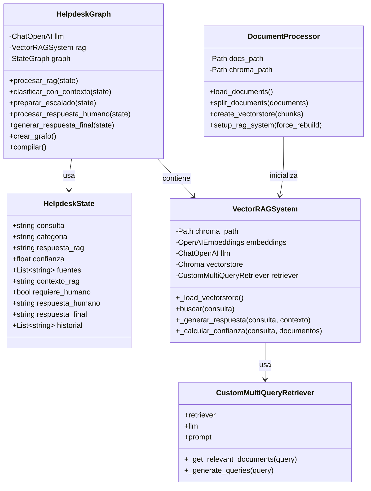
```mermaid
classDiagram
    class HelpdeskState {
        +string consulta
        +string categoria
        +string respuesta_rag
        +float confianza
        +List~string~ fuentes
        +string contexto_rag
        +bool requiere_humano
        +string respuesta_humano
        +string respuesta_final
        +List~string~ historial
    }
    
    class HelpdeskGraph {
        -ChatOpenAI llm
        -VectorRAGSystem rag
        -StateGraph graph
        +procesar_rag(state)
        +clasificar_con_contexto(state)
        +preparar_escalado(state)
        +procesar_respuesta_humano(state)
        +generar_respuesta_final(state)
        +crear_grafo()
        +compilar()
    }
    
    class VectorRAGSystem {
        -Path chroma_path
        -OpenAIEmbeddings embeddings
        -ChatOpenAI llm
        -Chroma vectorstore
        -CustomMultiQueryRetriever retriever
        +_load_vectorstore()
        +buscar(consulta)
        +_generar_respuesta(consulta, contexto)
        +_calcular_confianza(consulta, documentos)
    }
    
    class CustomMultiQueryRetriever {
        +retriever
        +llm
        +prompt
        +_get_relevant_documents(query)
        +_generate_queries(query)
    }
    
    class DocumentProcessor {
        -Path docs_path
        -Path chroma_path
        +load_documents()
        +split_documents(documents)
        +create_vectorstore(chunks)
        +setup_rag_system(force_rebuild)
    }
    
    HelpdeskGraph --> HelpdeskState : usa
    HelpdeskGraph --> VectorRAGSystem : contiene
    VectorRAGSystem --> CustomMultiQueryRetriever : usa
    DocumentProcessor --> VectorRAGSystem : inicializa
```

---

## 🗃️ Diagrama de Base de Datos

### SQLite Checkpointer Schema

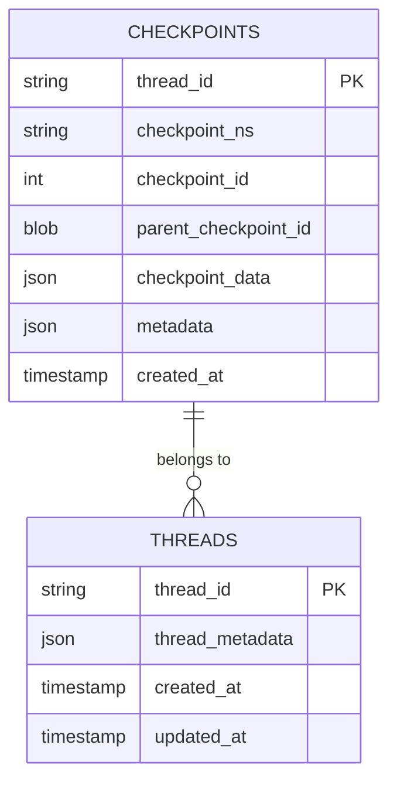
```mermaid
erDiagram
    CHECKPOINTS {
        string thread_id PK
        string checkpoint_ns
        int checkpoint_id
        blob parent_checkpoint_id
        json checkpoint_data
        json metadata
        timestamp created_at
    }
    
    THREADS {
        string thread_id PK
        json thread_metadata
        timestamp created_at
        timestamp updated_at
    }
    
    CHECKPOINTS ||--o{ THREADS : "belongs to"
```

### ChromaDB Collection Schema

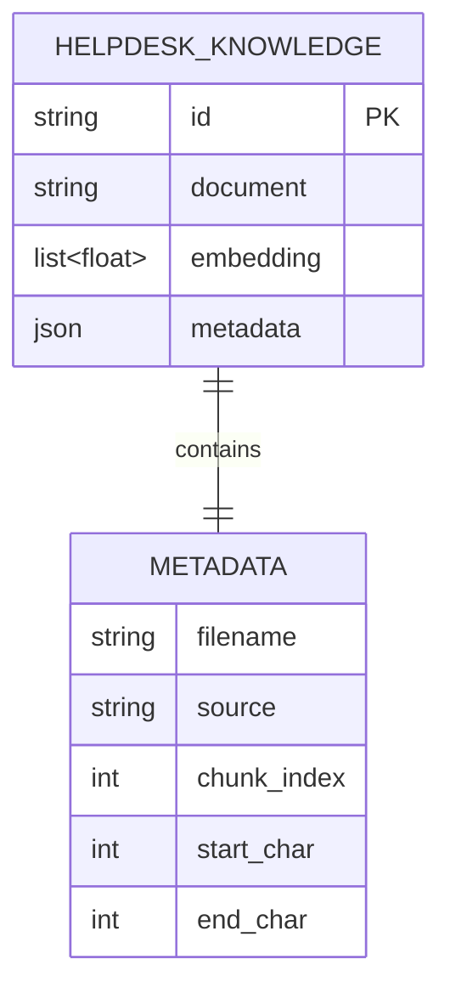
```mermaid
erDiagram
    HELPDESK_KNOWLEDGE {
        string id PK
        string document
        list~float~ embedding
        json metadata
    }
    
    METADATA {
        string filename
        string source
        int chunk_index
        int start_char
        int end_char
    }
    
    HELPDESK_KNOWLEDGE ||--|| METADATA : contains
```

---

## 📊 Diagrama de Flujo de Datos

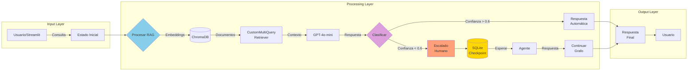
```mermaid
flowchart LR
    subgraph "Input Layer"
        A[Usuario/Streamlit] -->|Consulta| B[Estado Inicial]
    end
    
    subgraph "Processing Layer"
        B --> C{Procesar RAG}
        C -->|Embeddings| D[(ChromaDB)]
        D -->|Documentos| E[CustomMultiQuery<br/>Retriever]
        E -->|Contexto| F[GPT-4o-mini]
        F -->|Respuesta| G{Clasificar}
        
        G -->|Confianza > 0.6| H[Respuesta<br/>Automática]
        G -->|Confianza < 0.6| I[Escalado<br/>Humano]
        
        I --> J[(SQLite<br/>Checkpoint)]
        J -->|Esperar| K[Agente]
        K -->|Respuesta| L[Continuar<br/>Grafo]
    end
    
    subgraph "Output Layer"
        H --> M[Respuesta<br/>Final]
        L --> M
        M --> N[Usuario]
    end
    
    style C fill:#87CEEB
    style G fill:#DDA0DD
    style I fill:#FFA07A
    style J fill:#FFD700
```

---

## 🔐 Diagrama de Seguridad y Autenticación

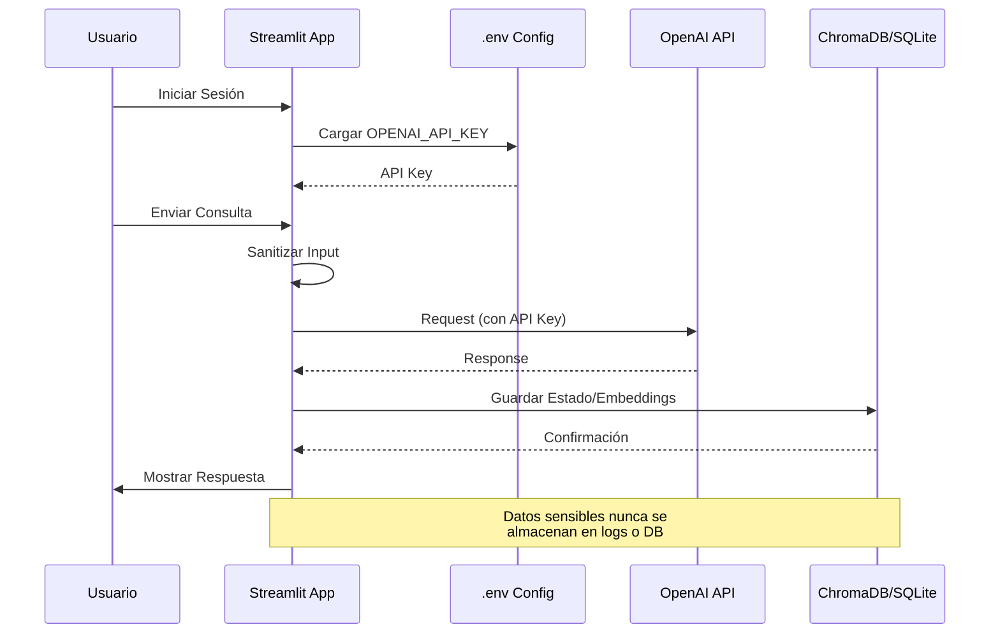
```mermaid
sequenceDiagram
    participant U as Usuario
    participant App as Streamlit App
    participant Env as .env Config
    participant OpenAI as OpenAI API
    participant DB as ChromaDB/SQLite
    
    U->>App: Iniciar Sesión
    App->>Env: Cargar OPENAI_API_KEY
    Env-->>App: API Key
    
    U->>App: Enviar Consulta
    App->>App: Sanitizar Input
    App->>OpenAI: Request (con API Key)
    OpenAI-->>App: Response
    
    App->>DB: Guardar Estado/Embeddings
    DB-->>App: Confirmación
    
    App->>U: Mostrar Respuesta
    
    Note over App,DB: Datos sensibles nunca se<br/>almacenan en logs o DB
```

---

## 🧠 Diagrama de Procesamiento RAG Detallado

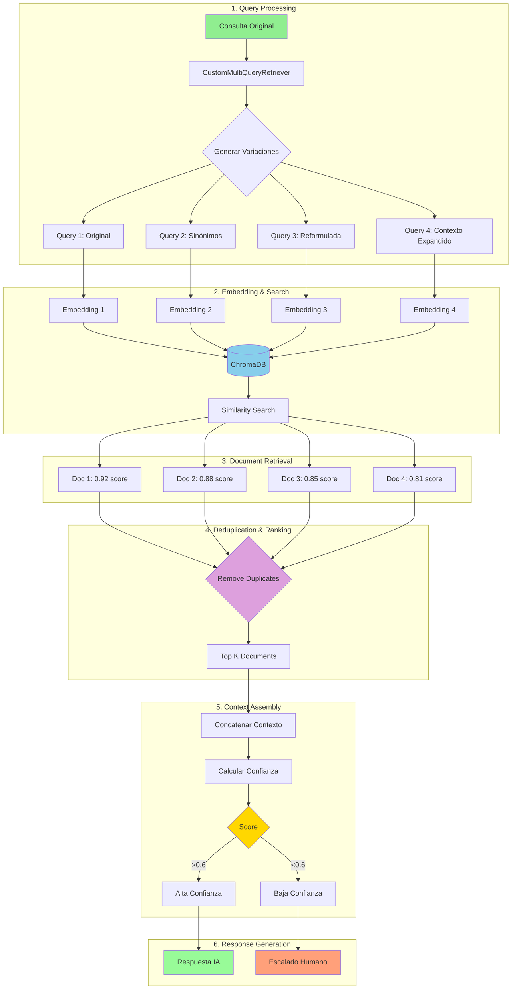
```mermaid
graph TD
    subgraph "1. Query Processing"
        A[Consulta Original] --> B[CustomMultiQueryRetriever]
        B --> C{Generar Variaciones}
        C --> D[Query 1: Original]
        C --> E[Query 2: Sinónimos]
        C --> F[Query 3: Reformulada]
        C --> G[Query 4: Contexto Expandido]
    end
    
    subgraph "2. Embedding & Search"
        D --> H[Embedding 1]
        E --> I[Embedding 2]
        F --> J[Embedding 3]
        G --> K[Embedding 4]
        
        H --> L[(ChromaDB)]
        I --> L
        J --> L
        K --> L
        
        L --> M[Similarity Search]
    end
    
    subgraph "3. Document Retrieval"
        M --> N[Doc 1: 0.92 score]
        M --> O[Doc 2: 0.88 score]
        M --> P[Doc 3: 0.85 score]
        M --> Q[Doc 4: 0.81 score]
    end
    
    subgraph "4. Deduplication & Ranking"
        N --> R{Remove Duplicates}
        O --> R
        P --> R
        Q --> R
        
        R --> S[Top K Documents]
    end
    
    subgraph "5. Context Assembly"
        S --> T[Concatenar Contexto]
        T --> U[Calcular Confianza]
        U --> V{Score}
        V -->|>0.6| W[Alta Confianza]
        V -->|<0.6| X[Baja Confianza]
    end
    
    subgraph "6. Response Generation"
        W --> Y[Respuesta IA]
        X --> Z[Escalado Humano]
    end
    
    style A fill:#90EE90
    style L fill:#87CEEB
    style R fill:#DDA0DD
    style V fill:#FFD700
    style Y fill:#98FB98
    style Z fill:#FFA07A
```

---

## 🔄 Diagrama de Estados del Ticket

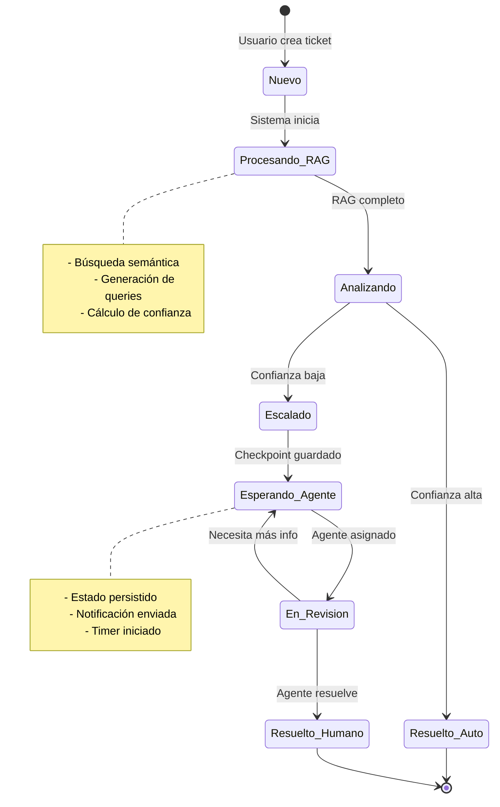
```mermaid
stateDiagram-v2
    [*] --> Nuevo: Usuario crea ticket
    
    Nuevo --> Procesando_RAG: Sistema inicia
    
    Procesando_RAG --> Analizando: RAG completo
    
    Analizando --> Resuelto_Auto: Confianza alta
    Analizando --> Escalado: Confianza baja
    
    Escalado --> Esperando_Agente: Checkpoint guardado
    
    Esperando_Agente --> En_Revision: Agente asignado
    
    En_Revision --> Esperando_Agente: Necesita más info
    En_Revision --> Resuelto_Humano: Agente resuelve
    
    Resuelto_Auto --> [*]
    Resuelto_Humano --> [*]
    
    note right of Procesando_RAG
        - Búsqueda semántica
        - Generación de queries
        - Cálculo de confianza
    end note
    
    note right of Esperando_Agente
        - Estado persistido
        - Notificación enviada
        - Timer iniciado
    end note
```

---

## 🎯 Diagrama de Toma de Decisiones (Clasificación)

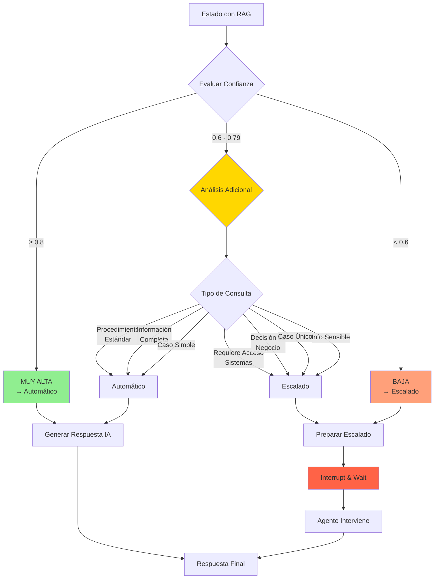
```mermaid
flowchart TD
    A[Estado con RAG] --> B{Evaluar Confianza}
    
    B -->|≥ 0.8| C[MUY ALTA<br/>→ Automático]
    B -->|0.6 - 0.79| D{Análisis Adicional}
    B -->|< 0.6| E[BAJA<br/>→ Escalado]
    
    D --> F{Tipo de Consulta}
    
    F -->|Procedimiento<br/>Estándar| G[Automático]
    F -->|Información<br/>Completa| G
    F -->|Caso Simple| G
    
    F -->|Requiere Acceso<br/>Sistemas| H[Escalado]
    F -->|Decisión de<br/>Negocio| H
    F -->|Caso Único| H
    F -->|Info Sensible| H
    
    C --> I[Generar Respuesta IA]
    G --> I
    E --> J[Preparar Escalado]
    H --> J
    
    I --> K[Respuesta Final]
    J --> L[Interrupt & Wait]
    L --> M[Agente Interviene]
    M --> K
    
    style C fill:#90EE90
    style E fill:#FFA07A
    style D fill:#FFD700
    style L fill:#FF6347
```

---

## 📈 Diagrama de Métricas y Monitoreo

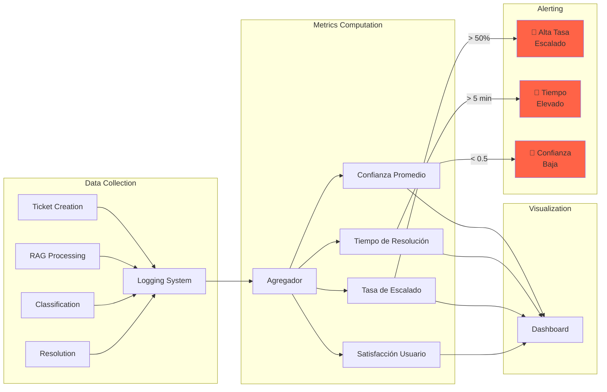
```mermaid
graph LR
    subgraph "Data Collection"
        A[Ticket Creation] --> B[Logging System]
        C[RAG Processing] --> B
        D[Classification] --> B
        E[Resolution] --> B
    end
    
    subgraph "Metrics Computation"
        B --> F[Agregador]
        F --> G[Confianza Promedio]
        F --> H[Tiempo de Resolución]
        F --> I[Tasa de Escalado]
        F --> J[Satisfacción Usuario]
    end
    
    subgraph "Visualization"
        G --> K[Dashboard]
        H --> K
        I --> K
        J --> K
    end
    
    subgraph "Alerting"
        I -->|> 50%| L[🚨 Alta Tasa<br/>Escalado]
        H -->|> 5 min| M[🚨 Tiempo<br/>Elevado]
        G -->|< 0.5| N[🚨 Confianza<br/>Baja]
    end
    
    style L fill:#FF6347
    style M fill:#FF6347
    style N fill:#FF6347
```

---

## 🔧 Diagrama de Configuración y Deployment

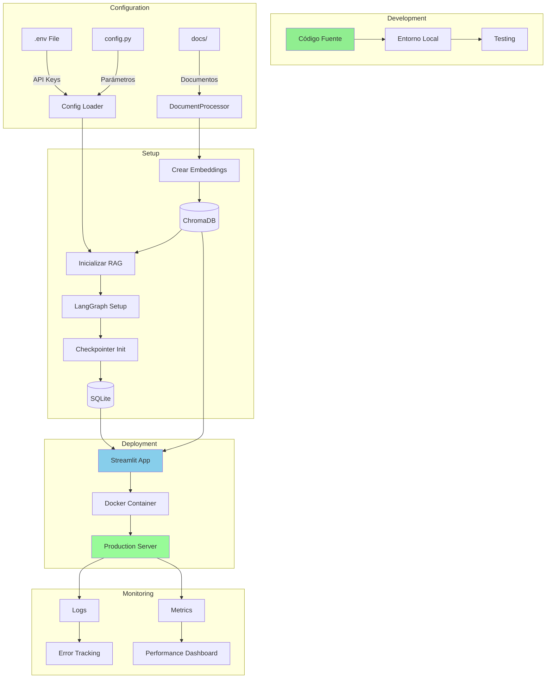
```mermaid
flowchart TD
    subgraph "Development"
        A[Código Fuente] --> B[Entorno Local]
        B --> C[Testing]
    end
    
    subgraph "Configuration"
        D[.env File] -->|API Keys| E[Config Loader]
        F[config.py] -->|Parámetros| E
        G[docs/] -->|Documentos| H[DocumentProcessor]
    end
    
    subgraph "Setup"
        E --> I[Inicializar RAG]
        H --> J[Crear Embeddings]
        J --> K[(ChromaDB)]
        K --> I
        I --> L[LangGraph Setup]
        L --> M[Checkpointer Init]
        M --> N[(SQLite)]
    end
    
    subgraph "Deployment"
        N --> O[Streamlit App]
        K --> O
        O --> P[Docker Container]
        P --> Q[Production Server]
    end
    
    subgraph "Monitoring"
        Q --> R[Logs]
        Q --> S[Metrics]
        R --> T[Error Tracking]
        S --> U[Performance Dashboard]
    end
    
    style A fill:#90EE90
    style O fill:#87CEEB
    style Q fill:#98FB98
```

---

## 🧪 Diagrama de Testing

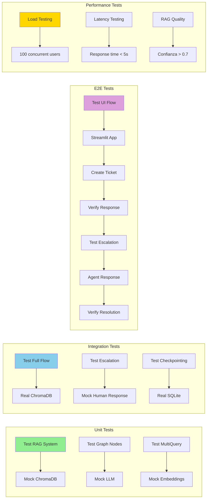
```mermaid
flowchart LR
    subgraph "Unit Tests"
        A[Test RAG System] --> B[Mock ChromaDB]
        C[Test Graph Nodes] --> D[Mock LLM]
        E[Test MultiQuery] --> F[Mock Embeddings]
    end
    
    subgraph "Integration Tests"
        G[Test Full Flow] --> H[Real ChromaDB]
        I[Test Escalation] --> J[Mock Human Response]
        K[Test Checkpointing] --> L[Real SQLite]
    end
    
    subgraph "E2E Tests"
        M[Test UI Flow] --> N[Streamlit App]
        N --> O[Create Ticket]
        O --> P[Verify Response]
        P --> Q[Test Escalation]
        Q --> R[Agent Response]
        R --> S[Verify Resolution]
    end
    
    subgraph "Performance Tests"
        T[Load Testing] --> U[100 concurrent users]
        V[Latency Testing] --> W[Response time < 5s]
        X[RAG Quality] --> Y[Confianza > 0.7]
    end
    
    style A fill:#90EE90
    style G fill:#87CEEB
    style M fill:#DDA0DD
    style T fill:#FFD700
```

---

## 🔄 Diagrama de Ciclo de Vida del Ticket

```mermaid
gantt
    title Ciclo de Vida de un Ticket
    dateFormat  ss
    axisFormat %S
    
    section Usuario
    Crea Ticket           :a1, 00, 1s
    Espera Respuesta      :a2, after a1, 4s
    Recibe Respuesta      :a3, after a2, 1s
    
    section Sistema
    Inicializa Estado     :b1, 00, 1s
    Procesa RAG           :b2, after b1, 2s
    Clasifica             :b3, after b2, 1s
    
    section Respuesta Automática
    Genera Respuesta      :c1, after b3, 1s
    Entrega Usuario       :c2, after c1, 1s
    
    section Escalado Humano
    Guarda Checkpoint     :d1, after b3, 1s
    Notifica Agente       :d2, after d1, 1s
    Espera Respuesta      :d3, after d2, 120s
    Procesa Respuesta     :d4, after d3, 1s
    Finaliza Ticket       :d5, after d4, 1s
```

---

## 📦 Diagrama de Dependencias

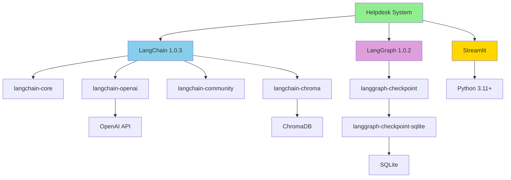
```mermaid
graph TD
    A[Helpdesk System] --> B[LangChain 1.0.3]
    A --> C[LangGraph 1.0.2]
    A --> D[Streamlit]
    
    B --> E[langchain-core]
    B --> F[langchain-openai]
    B --> G[langchain-community]
    B --> H[langchain-chroma]
    
    C --> I[langgraph-checkpoint]
    I --> J[langgraph-checkpoint-sqlite]
    
    F --> K[OpenAI API]
    H --> L[ChromaDB]
    J --> M[SQLite]
    
    D --> N[Python 3.11+]
    
    style A fill:#90EE90
    style B fill:#87CEEB
    style C fill:#DDA0DD
    style D fill:#FFD700
```

---

## 🎨 Diagrama de Componentes de UI

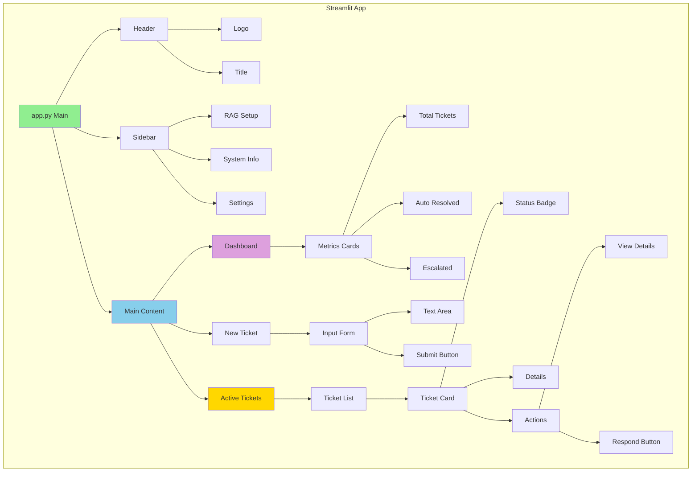
```mermaid
graph TB
    subgraph "Streamlit App"
        A[app.py Main] --> B[Header]
        A --> C[Sidebar]
        A --> D[Main Content]
        
        B --> E[Logo]
        B --> F[Title]
        
        C --> G[RAG Setup]
        C --> H[System Info]
        C --> I[Settings]
        
        D --> J[Dashboard]
        D --> K[New Ticket]
        D --> L[Active Tickets]
        
        J --> M[Metrics Cards]
        M --> N[Total Tickets]
        M --> O[Auto Resolved]
        M --> P[Escalated]
        
        K --> Q[Input Form]
        Q --> R[Text Area]
        Q --> S[Submit Button]
        
        L --> T[Ticket List]
        T --> U[Ticket Card]
        U --> V[Status Badge]
        U --> W[Details]
        U --> X[Actions]
        
        X --> Y[View Details]
        X --> Z[Respond Button]
    end
    
    style A fill:#90EE90
    style D fill:#87CEEB
    style J fill:#DDA0DD
    style L fill:#FFD700
```

---

## 🔐 Diagrama de Manejo de Errores

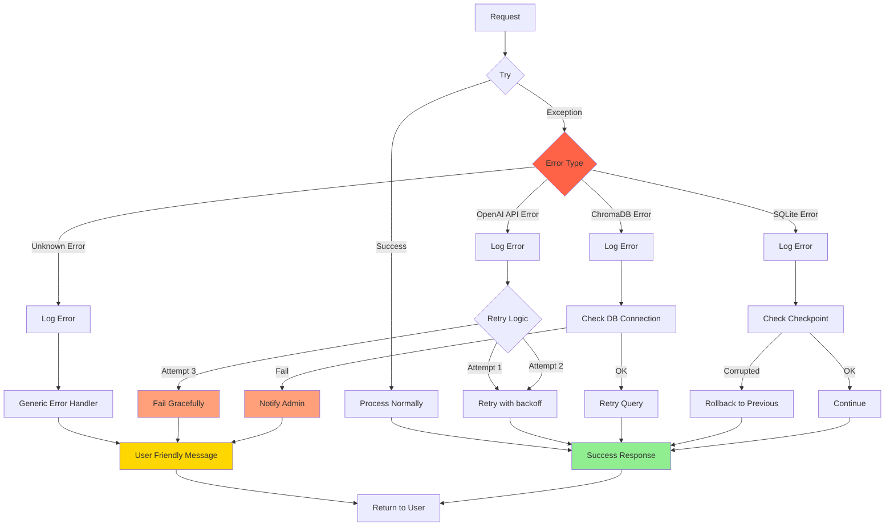
```mermaid
flowchart TD
    A[Request] --> B{Try}
    
    B -->|Success| C[Process Normally]
    B -->|Exception| D{Error Type}
    
    D -->|OpenAI API Error| E[Log Error]
    D -->|ChromaDB Error| F[Log Error]
    D -->|SQLite Error| G[Log Error]
    D -->|Unknown Error| H[Log Error]
    
    E --> I{Retry Logic}
    I -->|Attempt 1| J[Retry with backoff]
    I -->|Attempt 2| J
    I -->|Attempt 3| K[Fail Gracefully]
    
    F --> L[Check DB Connection]
    L -->|OK| M[Retry Query]
    L -->|Fail| N[Notify Admin]
    
    G --> O[Check Checkpoint]
    O -->|Corrupted| P[Rollback to Previous]
    O -->|OK| Q[Continue]
    
    H --> R[Generic Error Handler]
    R --> S[User Friendly Message]
    
    C --> T[Success Response]
    J --> T
    K --> S
    M --> T
    N --> S
    P --> T
    Q --> T
    S --> U[Return to User]
    T --> U
    
    style D fill:#FF6347
    style K fill:#FFA07A
    style N fill:#FFA07A
    style S fill:#FFD700
    style T fill:#90EE90
```

---

## 📊 Diagrama de Performance y Optimización

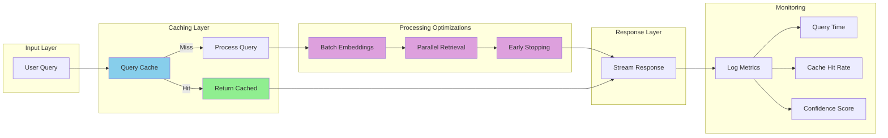
```mermaid
graph LR
    subgraph "Input Layer"
        A[User Query]
    end
    
    subgraph "Caching Layer"
        B[Query Cache] -->|Hit| C[Return Cached]
        B -->|Miss| D[Process Query]
    end
    
    subgraph "Processing Optimizations"
        D --> E[Batch Embeddings]
        E --> F[Parallel Retrieval]
        F --> G[Early Stopping]
    end
    
    subgraph "Response Layer"
        G --> H[Stream Response]
        C --> H
    end
    
    subgraph "Monitoring"
        H --> I[Log Metrics]
        I --> J[Query Time]
        I --> K[Cache Hit Rate]
        I --> L[Confidence Score]
    end
    
    A --> B
    
    style B fill:#87CEEB
    style C fill:#90EE90
    style E fill:#DDA0DD
    style F fill:#DDA0DD
    style G fill:#DDA0DD
```

---

## 🔄 Diagrama de Actualización de Base de Conocimiento

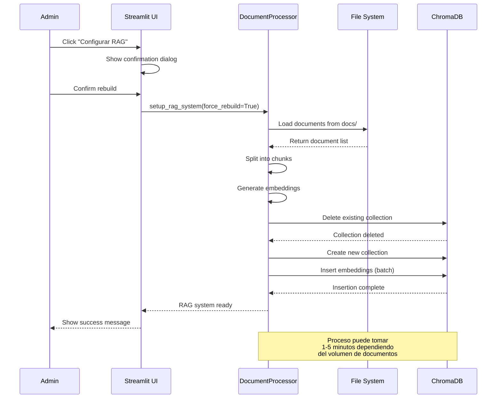
```mermaid
sequenceDiagram
    participant A as Admin
    participant UI as Streamlit UI
    participant DP as DocumentProcessor
    participant FS as File System
    participant VDB as ChromaDB
    
    A->>UI: Click "Configurar RAG"
    UI->>UI: Show confirmation dialog
    A->>UI: Confirm rebuild
    
    UI->>DP: setup_rag_system(force_rebuild=True)
    DP->>FS: Load documents from docs/
    FS-->>DP: Return document list
    
    DP->>DP: Split into chunks
    DP->>DP: Generate embeddings
    
    DP->>VDB: Delete existing collection
    VDB-->>DP: Collection deleted
    
    DP->>VDB: Create new collection
    DP->>VDB: Insert embeddings (batch)
    VDB-->>DP: Insertion complete
    
    DP-->>UI: RAG system ready
    UI-->>A: Show success message
    
    Note over DP,VDB: Proceso puede tomar<br/>1-5 minutos dependiendo<br/>del volumen de documentos
```

---

## 🎯 Diagrama de Estrategia de Caché

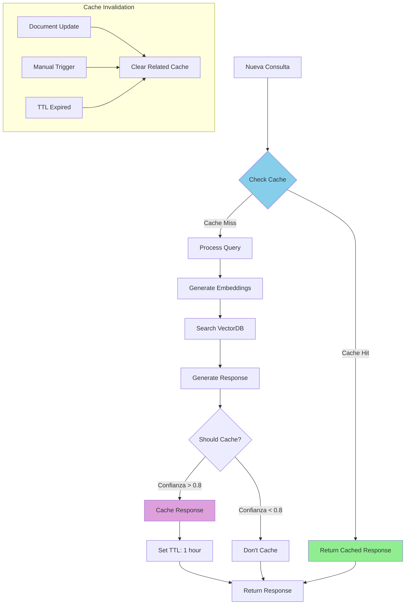
```mermaid
flowchart TD
    A[Nueva Consulta] --> B{Check Cache}
    
    B -->|Cache Hit| C[Return Cached Response]
    B -->|Cache Miss| D[Process Query]
    
    D --> E[Generate Embeddings]
    E --> F[Search VectorDB]
    F --> G[Generate Response]
    
    G --> H{Should Cache?}
    
    H -->|Confianza > 0.8| I[Cache Response]
    H -->|Confianza < 0.8| J[Don't Cache]
    
    I --> K[Set TTL: 1 hour]
    K --> L[Return Response]
    J --> L
    C --> L
    
    subgraph "Cache Invalidation"
        M[Document Update] --> N[Clear Related Cache]
        O[Manual Trigger] --> N
        P[TTL Expired] --> N
    end
    
    style B fill:#87CEEB
    style C fill:#90EE90
    style I fill:#DDA0DD
```

---

## 🛠️ Diagrama de Herramientas de Desarrollo

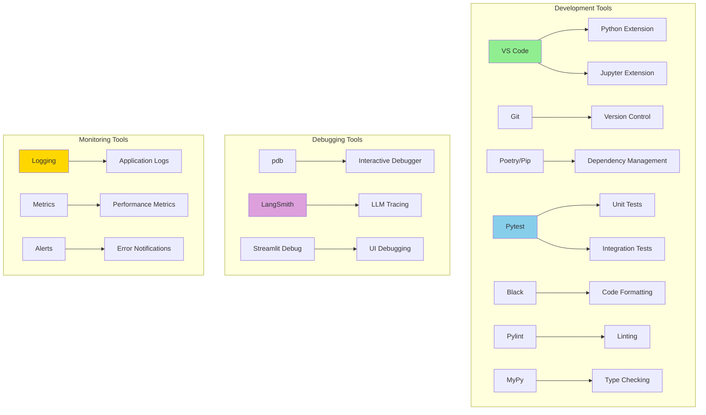
```mermaid
graph TB
    subgraph "Development Tools"
        A[VS Code] --> B[Python Extension]
        A --> C[Jupyter Extension]
        
        D[Git] --> E[Version Control]
        
        F[Poetry/Pip] --> G[Dependency Management]
        
        H[Pytest] --> I[Unit Tests]
        H --> J[Integration Tests]
        
        K[Black] --> L[Code Formatting]
        M[Pylint] --> N[Linting]
        O[MyPy] --> P[Type Checking]
    end
    
    subgraph "Debugging Tools"
        Q[pdb] --> R[Interactive Debugger]
        S[LangSmith] --> T[LLM Tracing]
        U[Streamlit Debug] --> V[UI Debugging]
    end
    
    subgraph "Monitoring Tools"
        W[Logging] --> X[Application Logs]
        Y[Metrics] --> Z[Performance Metrics]
        AA[Alerts] --> AB[Error Notifications]
    end
    
    style A fill:#90EE90
    style H fill:#87CEEB
    style S fill:#DDA0DD
    style W fill:#FFD700
```

---

**Última actualización:** Noviembre 2025  
**Versión:** 1.0  
**Mantenedor:** Jose Balbuena
