# 📐 Diagramas Técnicos del Sistema Helpdesk

Este documento contiene diagramas técnicos detallados para desarrolladores que deseen entender la arquitectura interna del sistema.

---

## 🔄 Diagrama de Clases

---

## 🗃️ Diagrama de Base de Datos

### SQLite Checkpointer Schema

### ChromaDB Collection Schema

---

## 📊 Diagrama de Flujo de Datos

---

## 🔐 Diagrama de Seguridad y Autenticación

```mermaid
sequenceDiagram
    participant U as Usuario
    participant App as Streamlit App
    participant Env as .env Config
    participant OpenAI as OpenAI API
    participant DB as ChromaDB/SQLite
    
    U->>App: Iniciar Sesión
    App->>Env: Cargar OPENAI_API_KEY
    Env-->>App: API Key
    
    U->>App: Enviar Consulta
    App->>App: Sanitizar Input
    App->>OpenAI: Request (con API Key)
    OpenAI-->>App: Response
    
    App->>DB: Guardar Estado/Embeddings
    DB-->>App: Confirmación
    
    App->>U: Mostrar Respuesta
    
    Note over App,DB: Datos sensibles nunca se<br/>almacenan en logs o DB
```

---

## 🧠 Diagrama de Procesamiento RAG Detallado

---

## 🔄 Diagrama de Estados del Ticket

```mermaid
stateDiagram-v2
    [*] --> Nuevo: Usuario crea ticket
    
    Nuevo --> Procesando_RAG: Sistema inicia
    
    Procesando_RAG --> Analizando: RAG completo
    
    Analizando --> Resuelto_Auto: Confianza alta
    Analizando --> Escalado: Confianza baja
    
    Escalado --> Esperando_Agente: Checkpoint guardado
    
    Esperando_Agente --> En_Revision: Agente asignado
    
    En_Revision --> Esperando_Agente: Necesita más info
    En_Revision --> Resuelto_Humano: Agente resuelve
    
    Resuelto_Auto --> [*]
    Resuelto_Humano --> [*]
    
    note right of Procesando_RAG
        - Búsqueda semántica
        - Generación de queries
        - Cálculo de confianza
    end note
    
    note right of Esperando_Agente
        - Estado persistido
        - Notificación enviada
        - Timer iniciado
    end note
```

---

## 🎯 Diagrama de Toma de Decisiones (Clasificación)

```mermaid
flowchart TD
    A[Estado con RAG] --> B{Evaluar Confianza}
    
    B -->|≥ 0.8| C[MUY ALTA<br/>→ Automático]
    B -->|0.6 - 0.79| D{Análisis Adicional}
    B -->|< 0.6| E[BAJA<br/>→ Escalado]
    
    D --> F{Tipo de Consulta}
    
    F -->|Procedimiento<br/>Estándar| G[Automático]
    F -->|Información<br/>Completa| G
    F -->|Caso Simple| G
    
    F -->|Requiere Acceso<br/>Sistemas| H[Escalado]
    F -->|Decisión de<br/>Negocio| H
    F -->|Caso Único| H
    F -->|Info Sensible| H
    
    C --> I[Generar Respuesta IA]
    G --> I
    E --> J[Preparar Escalado]
    H --> J
    
    I --> K[Respuesta Final]
    J --> L[Interrupt & Wait]
    L --> M[Agente Interviene]
    M --> K
    
    style C fill:#90EE90
    style E fill:#FFA07A
    style D fill:#FFD700
    style L fill:#FF6347
```

---

## 📈 Diagrama de Métricas y Monitoreo

```mermaid
graph LR
    subgraph "Data Collection"
        A[Ticket Creation] --> B[Logging System]
        C[RAG Processing] --> B
        D[Classification] --> B
        E[Resolution] --> B
    end
    
    subgraph "Metrics Computation"
        B --> F[Agregador]
        F --> G[Confianza Promedio]
        F --> H[Tiempo de Resolución]
        F --> I[Tasa de Escalado]
        F --> J[Satisfacción Usuario]
    end
    
    subgraph "Visualization"
        G --> K[Dashboard]
        H --> K
        I --> K
        J --> K
    end
    
    subgraph "Alerting"
        I -->|> 50%| L[🚨 Alta Tasa<br/>Escalado]
        H -->|> 5 min| M[🚨 Tiempo<br/>Elevado]
        G -->|< 0.5| N[🚨 Confianza<br/>Baja]
    end
    
    style L fill:#FF6347
    style M fill:#FF6347
    style N fill:#FF6347
```

---

## 🔧 Diagrama de Configuración y Deployment

```mermaid
flowchart TD
    subgraph "Development"
        A[Código Fuente] --> B[Entorno Local]
        B --> C[Testing]
    end
    
    subgraph "Configuration"
        D[.env File] -->|API Keys| E[Config Loader]
        F[config.py] -->|Parámetros| E
        G[docs/] -->|Documentos| H[DocumentProcessor]
    end
    
    subgraph "Setup"
        E --> I[Inicializar RAG]
        H --> J[Crear Embeddings]
        J --> K[(ChromaDB)]
        K --> I
        I --> L[LangGraph Setup]
        L --> M[Checkpointer Init]
        M --> N[(SQLite)]
    end
    
    subgraph "Deployment"
        N --> O[Streamlit App]
        K --> O
        O --> P[Docker Container]
        P --> Q[Production Server]
    end
    
    subgraph "Monitoring"
        Q --> R[Logs]
        Q --> S[Metrics]
        R --> T[Error Tracking]
        S --> U[Performance Dashboard]
    end
    
    style A fill:#90EE90
    style O fill:#87CEEB
    style Q fill:#98FB98
```

---

## 🧪 Diagrama de Testing

---

## 🔄 Diagrama de Ciclo de Vida del Ticket

---

## 📦 Diagrama de Dependencias

---

## 🎨 Diagrama de Componentes de UI

---

## 🔐 Diagrama de Manejo de Errores

---

## 📊 Diagrama de Performance y Optimización

---

## 🔄 Diagrama de Actualización de Base de Conocimiento

---

## 🎯 Diagrama de Estrategia de Caché

---

## 🛠️ Diagrama de Herramientas de Desarrollo

---

**Última actualización:** Noviembre 2025  
**Versión:** 1.0  
**Mantenedor:** Jose Balbuena
