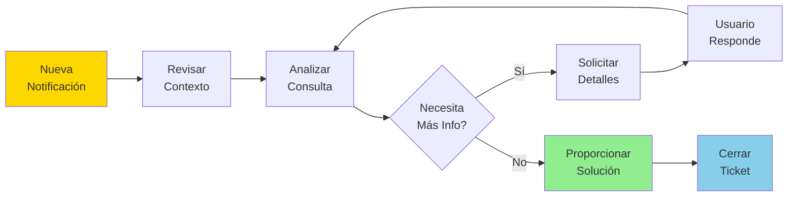

# 🚀 Guía Rápida de Usuario - Sistema Helpdesk

Esta guía te ayudará a usar el sistema Helpdesk de manera efectiva.

---

## 📋 Contenido

1. [Inicio Rápido](#-inicio-rápido)
2. [Crear un Ticket](#-crear-un-ticket)
3. [Entender las Respuestas](#-entender-las-respuestas)
4. [Para Agentes de Soporte](#-para-agentes-de-soporte)
5. [Preguntas Frecuentes](#-preguntas-frecuentes)

---

## 🎯 Inicio Rápido

### Acceder al Sistema

1. Abre tu navegador web
2. Ve a: `http://localhost:8502` (o la URL proporcionada por tu administrador)
3. Verás la pantalla principal del Helpdesk

---

## 🎫 Crear un Ticket

### Paso 1: Describe tu Problema

```
┌─────────────────────────────────────────┐
│  💬 ¿En qué podemos ayudarte hoy?       │
│  ┌─────────────────────────────────────┐│
│  │ Escribe tu consulta aquí...        ││
│  │                                     ││
│  │                                     ││
│  └─────────────────────────────────────┘│
│          [📤 Enviar Consulta]           │
└─────────────────────────────────────────┘
```

**Consejos para una buena consulta:**

✅ **BUENO:**
- "¿Cómo puedo resetear mi contraseña?"
- "No puedo acceder a mi cuenta desde ayer"
- "¿Cuál es el procedimiento para solicitar vacaciones?"

❌ **EVITA:**
- "ayuda" (muy genérico)
- "problema" (sin detalles)
- "urgente!!!" (sin descripción)

### Paso 2: Espera la Respuesta

El sistema procesará tu consulta de dos formas:

#### 🤖 Respuesta Automática (Rápida)

```
┌─────────────────────────────────────────┐
│  ✅ TICKET RESUELTO AUTOMÁTICAMENTE     │
│  ID: TK-A3F2E1                          │
│  ─────────────────────────────────────  │
│  Para resetear tu contraseña:           │
│  1. Ve a la página de inicio de sesión  │
│  2. Haz clic en "¿Olvidaste tu...      │
│  ...                                    │
│  ─────────────────────────────────────  │
│  📊 Confianza: 85%                      │
│  📚 Fuentes: manual_usuario.md          │
│  ⏱️ Tiempo: 3 segundos                  │
└─────────────────────────────────────────┘
```

#### 👤 Escalado a Agente (Casos Complejos)

```
┌─────────────────────────────────────────┐
│  ⏳ TICKET EN ESPERA DE AGENTE          │
│  ID: TK-B8D4C7                          │
│  ─────────────────────────────────────  │
│  Tu consulta requiere atención          │
│  personalizada. Un agente humano        │
│  responderá pronto.                     │
│  ─────────────────────────────────────  │
│  📊 Posición en cola: 2                 │
│  ⏱️ Tiempo estimado: 5 minutos          │
│  📧 Recibirás notificación por email    │
└─────────────────────────────────────────┘
```

---

## 📊 Entender las Respuestas

### Indicadores de Calidad

#### 🟢 Alta Confianza (> 80%)
- Información muy precisa
- Múltiples fuentes confirman la respuesta
- Puedes seguir las instrucciones con confianza

#### 🟡 Confianza Media (60-80%)
- Información probablemente correcta
- Puede requerir verificación adicional
- Si tienes dudas, solicita confirmación

#### 🔴 Baja Confianza (< 60%)
- Automáticamente escalado a agente humano
- Caso complejo o información insuficiente
- Un experto revisará tu consulta

### Elementos de una Respuesta

```
┌─────────────────────────────────────────┐
│  ✅ Respuesta a tu Consulta             │ ← Estado del ticket
│  ─────────────────────────────────────  │
│  [CONTENIDO DE LA RESPUESTA]            │ ← Solución a tu problema
│  ─────────────────────────────────────  │
│  📊 Confianza: 85%                      │ ← Nivel de certeza
│  📚 Fuentes:                            │ ← Documentos consultados
│      - Manual de Usuario (pág. 12)     │
│      - FAQ - Sección Contraseñas        │
│  ⏱️ Procesado en: 3.2 segundos          │ ← Tiempo de respuesta
│  🆔 ID del Ticket: TK-A3F2E1            │ ← Para seguimiento
└─────────────────────────────────────────┘
```

---

## 👨‍💼 Para Agentes de Soporte

### Panel de Agente

```
┌─────────────────────────────────────────┐
│  🎧 PANEL DE AGENTE                     │
│  ─────────────────────────────────────  │
│  📊 Tickets Pendientes: 3               │
│  ⏱️ Tiempo promedio respuesta: 4 min    │
└─────────────────────────────────────────┘

┌─────────────────────────────────────────┐
│  🔔 TICKET NUEVO - REQUIERE ATENCIÓN    │
│  ─────────────────────────────────────  │
│  ID: TK-B8D4C7                          │
│  Usuario: juan.perez@empresa.com        │
│  Fecha: 07/11/2025 14:32                │
│  ─────────────────────────────────────  │
│  📝 CONSULTA:                           │
│  "Tengo un problema con mi factura..."  │
│  ─────────────────────────────────────  │
│  🤖 CONTEXTO DEL SISTEMA:               │
│  - Confianza RAG: 35%                   │
│  - Categoría: Facturación               │
│  - Escalado por: Info insuficiente      │
│  ─────────────────────────────────────  │
│  📚 INFORMACIÓN ENCONTRADA:             │
│  [Extractos de documentos relevantes]   │
│  ─────────────────────────────────────  │
│  💬 TU RESPUESTA:                       │
│  ┌─────────────────────────────────────┐│
│  │ [Escribe tu respuesta aquí...]     ││
│  │                                     ││
│  └─────────────────────────────────────┘│
│  [✅ Responder y Cerrar Ticket]         │
└─────────────────────────────────────────┘
```

### Flujo de Trabajo del Agente



### Mejores Prácticas para Agentes

#### ✅ HAZ:
- Lee el contexto proporcionado por el sistema
- Usa lenguaje claro y profesional
- Proporciona pasos específicos
- Verifica que el usuario entienda
- Documenta soluciones para futura referencia

#### ❌ NO HAGAS:
- Ignorar el contexto del sistema RAG
- Respuestas genéricas sin personalización
- Asumir conocimientos técnicos del usuario
- Cerrar tickets sin confirmar resolución

---

## ❓ Preguntas Frecuentes

### 🔹 ¿Cuánto tiempo tarda en responder el sistema?

**Respuestas Automáticas:** 2-5 segundos  
**Respuestas con Agente:** 3-10 minutos (depende de la disponibilidad)

---

### 🔹 ¿Puedo consultar el historial de mis tickets?

Sí, en la sección "📋 Tickets Activos" puedes ver:
- Tickets abiertos
- Tickets resueltos
- Historial de conversaciones

---

### 🔹 ¿Qué hago si la respuesta automática no resuelve mi problema?

1. Haz clic en "🔄 Requiero ayuda adicional"
2. El ticket se escalará automáticamente a un agente
3. Recibirás una respuesta personalizada

---

### 🔹 ¿El sistema está disponible 24/7?

**Sistema Automático:** Sí, siempre disponible  
**Agentes Humanos:** Según horario de tu organización (generalmente 9 AM - 6 PM)

---

### 🔹 ¿Mis consultas son confidenciales?

Sí, todas las consultas son:
- ✅ Encriptadas en tránsito
- ✅ Almacenadas de forma segura
- ✅ Accesibles solo por agentes autorizados
- ✅ Nunca compartidas con terceros

---

### 🔹 ¿Cómo califica el sistema la "confianza"?

La confianza se calcula basándose en:
1. **Relevancia de documentos** (60%): Qué tan relacionados están con tu consulta
2. **Cantidad de fuentes** (20%): Múltiples fuentes = mayor confianza
3. **Calidad de información** (20%): Completitud y claridad del contenido

```
Ejemplo:
┌─────────────────────────────────────┐
│ Consulta: "¿Cómo resetear password?" │
│                                     │
│ ✅ 3 documentos muy relevantes      │
│ ✅ Procedimiento paso a paso        │
│ ✅ Múltiples fuentes confirman      │
│                                     │
│ RESULTADO: Confianza 85% 🟢         │
└─────────────────────────────────────┘
```

---

### 🔹 ¿Puedo adjuntar archivos?

**Versión Actual:** No soportado  
**Próximamente:** Adjuntos de imágenes y PDFs

**Alternativa Actual:**
1. Describe el problema detalladamente
2. Si un agente necesita archivos, te lo solicitará por email

---

### 🔹 ¿Qué tipo de consultas puede resolver automáticamente?

#### ✅ Resolución Automática:
- Procedimientos estándar (resetear contraseña, configurar cuenta)
- Preguntas sobre políticas (horarios, vacaciones, beneficios)
- Troubleshooting básico (problemas comunes con soluciones documentadas)
- Información general (ubicaciones, contactos, FAQs)

#### 👤 Requiere Agente Humano:
- Casos únicos o excepcionales
- Problemas con sistemas internos
- Decisiones que requieren autorización
- Información sensible o confidencial
- Conflictos o quejas

---

### 🔹 ¿Cómo puedo mejorar la calidad de las respuestas?

**Sé Específico:**
```
❌ "No funciona"
✅ "No puedo iniciar sesión en el portal desde hace 2 horas. 
    Me aparece error 'Credenciales inválidas' aunque uso 
    mi contraseña correcta."
```

**Proporciona Contexto:**
```
❌ "Tengo un problema"
✅ "Cuando intento subir un archivo PDF de más de 10MB 
    al sistema, me dice que el formato no es compatible. 
    ¿Hay algún límite de tamaño?"
```

**Usa Palabras Clave:**
```
❌ "Esa cosa de los días libres"
✅ "¿Cómo solicito vacaciones? ¿Cuál es el procedimiento 
    y a quién debo notificar?"
```

---

## 🎓 Tutoriales Visuales

### Tutorial 1: Crear tu Primer Ticket

```
Paso 1: Encuentra el formulario
┌─────────────────────────────┐
│ 🆕 CREAR NUEVO TICKET       │
│ [Aquí está el formulario]   │
└─────────────────────────────┘

Paso 2: Escribe tu consulta
┌─────────────────────────────┐
│ ¿En qué podemos ayudarte?   │
│ ┌───────────────────────────┐
│ │ ¿Cómo reseteo mi contra...│
│ └───────────────────────────┘
└─────────────────────────────┘

Paso 3: Envía
┌─────────────────────────────┐
│   [📤 Enviar Consulta]      │
└─────────────────────────────┘

Paso 4: Espera la respuesta
┌─────────────────────────────┐
│ ⏳ Procesando...            │
│ [Barra de progreso]         │
└─────────────────────────────┘

Paso 5: Lee la solución
┌─────────────────────────────┐
│ ✅ Ticket Resuelto          │
│ Aquí está la solución...    │
└─────────────────────────────┘
```

---

### Tutorial 2: Responder como Agente

```
Paso 1: Ver notificación
┌─────────────────────────────┐
│ 🔔 Nuevo Ticket (1)         │
└─────────────────────────────┘

Paso 2: Abrir ticket
┌─────────────────────────────┐
│ TK-B8D4C7                   │
│ [Click para expandir]       │
└─────────────────────────────┘

Paso 3: Revisar contexto
┌─────────────────────────────┐
│ 📝 Consulta Usuario:        │
│ "Problema con factura..."   │
│                             │
│ 🤖 Info del Sistema:        │
│ - Confianza: 35%            │
│ - Docs encontrados: 1       │
└─────────────────────────────┘

Paso 4: Escribir respuesta
┌─────────────────────────────┐
│ 💬 Tu Respuesta:            │
│ ┌───────────────────────────┐
│ │ Hola! He revisado tu...  │
│ └───────────────────────────┘
└─────────────────────────────┘

Paso 5: Enviar y cerrar
┌─────────────────────────────┐
│ [✅ Responder y Cerrar]     │
└─────────────────────────────┘

Paso 6: Confirmación
┌─────────────────────────────┐
│ ✅ Ticket TK-B8D4C7         │
│    cerrado exitosamente     │
└─────────────────────────────┘
```

---

## 📞 Contacto y Soporte

### ¿Problemas con el sistema?

**Opción 1: Crear un ticket**
```
Categoría: "Problemas técnicos con Helpdesk"
Describe: El problema que experimentas
```

**Opción 2: Contacto directo**
```
📧 Email: soporte-tecnico@empresa.com
📱 Teléfono: +XX XXX XXX XXXX
💬 Slack: #helpdesk-support
```

---

## 🏆 Tips para Usuarios Avanzados

### Búsqueda Rápida en Tickets

```
Usa el buscador:
🔍 [Buscar por ID, fecha, palabra clave...]

Ejemplos:
- "TK-A3F2E1" → Busca ticket específico
- "contraseña" → Todos los tickets sobre contraseñas
- "07/11/2025" → Tickets de esa fecha
```

### Atajos de Teclado

```
Ctrl + N  → Nuevo ticket
Ctrl + F  → Buscar tickets
Ctrl + R  → Refrescar vista
Esc       → Cerrar modal
```

### Exportar Historial

```
1. Ve a "Mis Tickets"
2. Click en "⬇️ Exportar"
3. Selecciona formato (PDF/CSV)
4. Descarga tu historial
```

---

## 📈 Indicadores de Rendimiento

```
┌─────────────────────────────────────┐
│ 📊 TUS ESTADÍSTICAS                 │
├─────────────────────────────────────┤
│ Tickets Totales:        45          │
│ Resueltos Automático:   38 (84%)    │
│ Con Agente:              7 (16%)    │
│ Tiempo Prom. Respuesta: 4.2 min     │
│ Satisfacción:           4.8/5 ⭐    │
└─────────────────────────────────────┘
```

---

## 🎯 Checklist de Mejor Ticket

Antes de enviar tu ticket, verifica:

- [ ] ✅ Describiste el problema claramente
- [ ] ✅ Incluiste información relevante (fecha, sistema afectado)
- [ ] ✅ Intentaste buscar en FAQs primero
- [ ] ✅ Usaste palabras clave específicas
- [ ] ✅ Proporcionaste contexto suficiente
- [ ] ✅ Revisaste tu ortografía

---

**¿Listo para empezar?** 🚀  
[Crear Mi Primer Ticket](#-crear-un-ticket)

---

**Última actualización:** Noviembre 2025  
**Versión:** 1.0  
**¿Preguntas?** Crea un ticket en el sistema 😊
