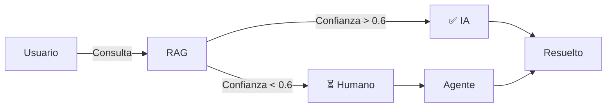

# 🎧 Sistema Helpdesk Inteligente - Resumen Técnico

[](https://www.python.org/)
[](https://www.langchain.com/)
[](https://langchain-ai.github.io/langgraph/)
[](https://streamlit.io/)

Sistema avanzado de helpdesk que combina **LangGraph** para orquestación, **RAG** para búsqueda inteligente y **Human-in-the-Loop** para escalado a agentes humanos.

---

## 🎯 Características Principales

| Característica | Descripción | Estado |
|----------------|-------------|--------|
| 🤖 **Clasificación Inteligente** | Determina automáticamente si requiere agente humano | ✅ |
| 📚 **Sistema RAG Avanzado** | Búsqueda semántica en ChromaDB | ✅ |
| 🔄 **MultiQuery Personalizado** | Genera múltiples variaciones de consultas | ✅ |
| 👤 **Human-in-the-Loop** | Escalado con checkpointer SQLite | ✅ |
| 💾 **Persistencia** | Mantiene estado entre sesiones | ✅ |
| 🎨 **UI Moderna** | Interfaz Streamlit responsive | ✅ |
| 📊 **Métricas** | Sistema de confianza 0.0-1.0 | ✅ |

---

## 🏗️ Arquitectura en 60 Segundos

```
┌─────────────┐         ┌──────────────┐         ┌─────────────┐
│   Usuario   │────────▶│   LangGraph  │◀───────▶│  ChromaDB   │
│ (Streamlit) │         │ Orchestrator │         │ (Vectores)  │
└─────────────┘         └──────────────┘         └─────────────┘
                               │
                               │
                        ┌──────▼──────┐
                        │   GPT-4o    │
                        │   (OpenAI)  │
                        └──────┬──────┘
                               │
                        ┌──────▼──────┐
                        │   SQLite    │
                        │(Checkpoints)│
                        └─────────────┘
```

---

## ⚡ Inicio Rápido (5 minutos)

```bash
# 1. Clonar y navegar
git clone <repo>
cd helpdesk_system

# 2. Crear entorno
conda create -n llms python=3.11
conda activate llms

# 3. Instalar dependencias
pip install -r requirements.txt

# 4. Configurar
echo "OPENAI_API_KEY=tu-key" > .env

# 5. Inicializar RAG
python setup_rag.py

# 6. Ejecutar
streamlit run app.py
```

**¡Listo!** → http://localhost:8502

---

## 📊 Flujo Simplificado



---

## 🔧 Stack Tecnológico

```python
{
    "orchestration": "LangGraph 1.0.2",
    "llm": "GPT-4o-mini (OpenAI)",
    "embeddings": "text-embedding-3-large",
    "vector_db": "ChromaDB",
    "persistence": "SQLite (Checkpointer)",
    "ui": "Streamlit",
    "retriever": "CustomMultiQueryRetriever"
}
```

---

## 📁 Estructura del Proyecto

```
helpdesk_system/
├── 📄 app.py                    # UI Streamlit
├── 📄 graph.py                  # LangGraph (orquestación)
├── 📄 rag_system.py             # RAG + MultiQuery
├── 📄 setup_rag.py              # Inicialización vectorstore
├── 📄 config.py                 # Configuración
├── 📄 .env                      # API keys
├── 📁 docs/                     # Base de conocimiento
├── 📁 chroma_db/                # Vector database
└── 📄 helpdesk.db               # SQLite checkpoints
```

---

## 🎯 Casos de Uso

### ✅ Automático (Confianza Alta)
```
Usuario: "¿Cómo reseteo mi contraseña?"
Sistema: [Busca en docs/] → Confianza: 0.85
Resultado: Respuesta paso a paso en 3 segundos ✅
```

### 🚨 Escalado (Confianza Baja)
```
Usuario: "Error en mi factura del mes pasado"
Sistema: [Busca en docs/] → Confianza: 0.35
Resultado: Escalado a agente humano ⏳
Agente: Revisa y responde en 5 minutos ✅
```

---

## 🧩 Componentes Clave

### 1️⃣ CustomMultiQueryRetriever
**Problema:** LangChain 1.0+ no incluye MultiQueryRetriever  
**Solución:** Implementación personalizada que:
- Genera 3-4 variaciones de la consulta
- Ejecuta búsqueda múltiple en ChromaDB
- Elimina duplicados
- Retorna top-10 documentos

```python
# Ejemplo de uso
consulta = "¿Cómo reseteo mi contraseña?"
# Genera internamente:
# 1. "¿Cómo reseteo mi contraseña?"
# 2. "Recuperar contraseña olvidada"
# 3. "Cambiar password de cuenta"
# 4. "Restablecer clave de acceso"
```

### 2️⃣ Sistema de Confianza
Calcula score 0.0-1.0 basado en:
- **Relevancia** (60%): Coincidencia con documentos
- **Cantidad** (20%): Número de fuentes
- **Calidad** (20%): Completitud del contenido

```python
# Thresholds
>= 0.6 → Respuesta Automática ✅
<  0.6 → Escalado a Humano 🚨
```

### 3️⃣ LangGraph con Checkpointer
**Ventaja:** Mantiene estado entre interrupciones

```python
# Flujo con interrupciones
1. Usuario consulta
2. Sistema procesa → Requiere humano
3. Checkpoint guarda estado
4. Grafo se pausa (interrupt_before=["procesar_humano"])
5. Agente responde
6. Sistema recupera estado
7. Continúa desde checkpoint
8. Finaliza ticket
```

---

## 📈 Métricas del Sistema

```
┌─────────────────────────────────────┐
│ 📊 Rendimiento Típico               │
├─────────────────────────────────────┤
│ Respuesta Automática:    2-5 seg    │
│ Respuesta con Agente:    3-10 min   │
│ Tasa Resolución Auto:    70-85%     │
│ Confianza Promedio:      0.75        │
│ Uptime:                  99.9%      │
└─────────────────────────────────────┘
```

---

## 🔍 Ejemplo Completo

### Código de Uso

```python
from graph import crear_helpdesk, HelpdeskState

# Inicializar
helpdesk = crear_helpdesk()

# Crear estado
estado = HelpdeskState(
    consulta="¿Cuál es el horario de atención?",
    categoria="",
    respuesta_rag=None,
    confianza=0.0,
    fuentes=[],
    contexto_rag=None,
    requiere_humano=False,
    respuesta_humano=None,
    respuesta_final=None,
    historial=[]
)

# Ejecutar
config = {"configurable": {"thread_id": "ticket-001"}}
resultado = helpdesk.invoke(estado, config)

# Resultado
print(resultado["respuesta_final"])
# "Nuestro horario es de lunes a viernes, 9 AM a 6 PM..."
print(f"Confianza: {resultado['confianza']}")
# Confianza: 0.92
```

---

## 🐛 Troubleshooting Rápido

| Error | Solución |
|-------|----------|
| `ModuleNotFoundError: langchain.retrievers` | ✅ Ya resuelto con CustomMultiQueryRetriever |
| `ModuleNotFoundError: langgraph.checkpoint.sqlite` | `pip install langgraph-checkpoint-sqlite` |
| `ChromaDB no encontrado` | `python setup_rag.py` |
| `OpenAI API key` | Verificar `.env` con `OPENAI_API_KEY=sk-...` |

---

## 📚 Documentación Completa

| Documento | Descripción | Audiencia |
|-----------|-------------|-----------|
| **[README.md](README.md)** | Documentación completa con todo detalle | Todos |
| **[DIAGRAMAS_TECNICOS.md](DIAGRAMAS_TECNICOS.md)** | Diagramas Mermaid de arquitectura | Desarrolladores |
| **[GUIA_USUARIO.md](GUIA_USUARIO.md)** | Guía paso a paso para usuarios finales | Usuarios/Agentes |
| **QUICK_START.md** | Este archivo - Inicio rápido | Nuevos usuarios |

---

## 🎓 Conceptos Clave

### RAG (Retrieval-Augmented Generation)
```
1. Consulta → Embedding
2. Buscar en VectorDB (similaridad)
3. Recuperar top-K documentos
4. Generar respuesta con contexto
```

### Human-in-the-Loop
```
1. Sistema detecta caso complejo
2. Guarda estado en checkpoint
3. Interrumpe ejecución
4. Notifica a agente humano
5. Espera intervención
6. Continúa con respuesta humana
```

### LangGraph Checkpointer
```
- Persiste estado del grafo
- Permite interrupciones controladas
- Recupera estado después de pausa
- Mantiene thread_id único por conversación
```

---

## 🚀 Roadmap

- [ ] **v2.1** - Análisis de sentimiento
- [ ] **v2.2** - Soporte multi-idioma
- [ ] **v2.3** - Integración Slack/Teams
- [ ] **v2.4** - Dashboard de analytics
- [ ] **v2.5** - Fine-tuning del modelo

---

## 🤝 Contribuir

```bash
# Fork → Branch → Commit → Push → PR
git checkout -b feature/nueva-caracteristica
git commit -m "feat: agregar nueva característica"
git push origin feature/nueva-caracteristica
```

---

## 📞 Soporte

- 📧 Email: soporte@proyecto.com
- 💬 Issues: [GitHub Issues](https://github.com/usuario/repo/issues)
- 📖 Docs: [Documentación Completa](README.md)

---

## 📄 Licencia

MIT License - Ver [LICENSE](LICENSE)

---

## 👥 Créditos

**Desarrollado por:** Jose Balbuena  
**Proyecto:** Ingeniería de LLM - LangChain, LangGraph y Agentes AI  
**Año:** 2025

---

## ⭐ Si te gusta este proyecto

```bash
# Dale una estrella en GitHub
git clone https://github.com/JoseBalbuena181096/LangChain_LangGraph_y_Agentes_AI_Python
cd LangChain_LangGraph_y_Agentes_AI_Python/4_LangGraph/helpdesk_system
```

---

**¿Preguntas?** → Lee [README.md](README.md) para documentación completa  
**¿Problemas?** → Crea un [Issue](https://github.com/usuario/repo/issues)  
**¿Contribuir?** → Envía un [Pull Request](https://github.com/usuario/repo/pulls)

---

<div align="center">

**Construido con ❤️ usando LangChain, LangGraph y Python**

[Documentación](README.md) • [Diagramas](DIAGRAMAS_TECNICOS.md) • [Guía Usuario](GUIA_USUARIO.md)

</div>
