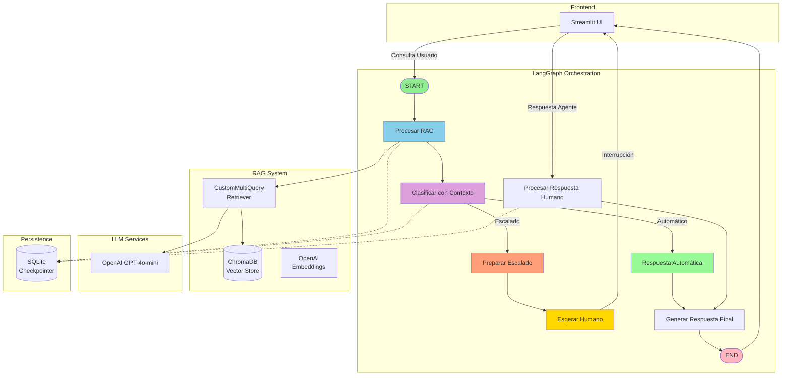
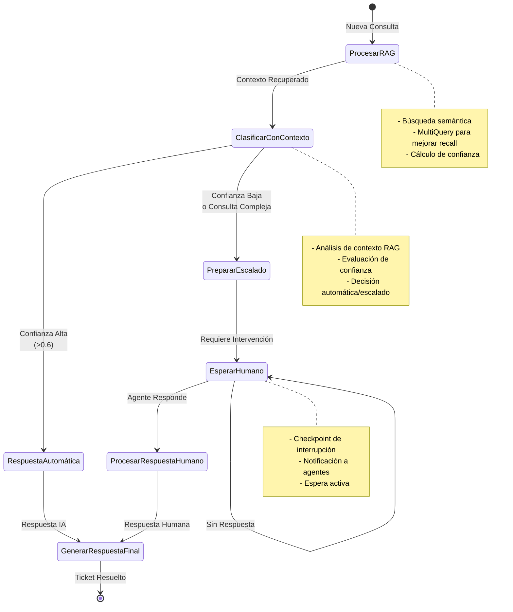
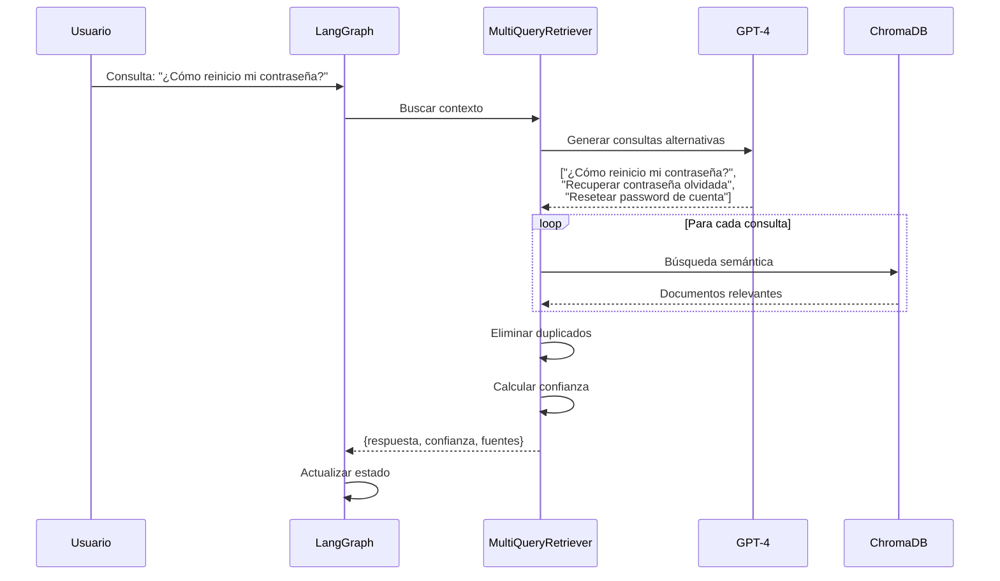
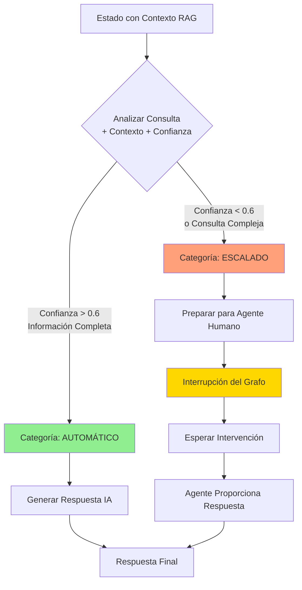
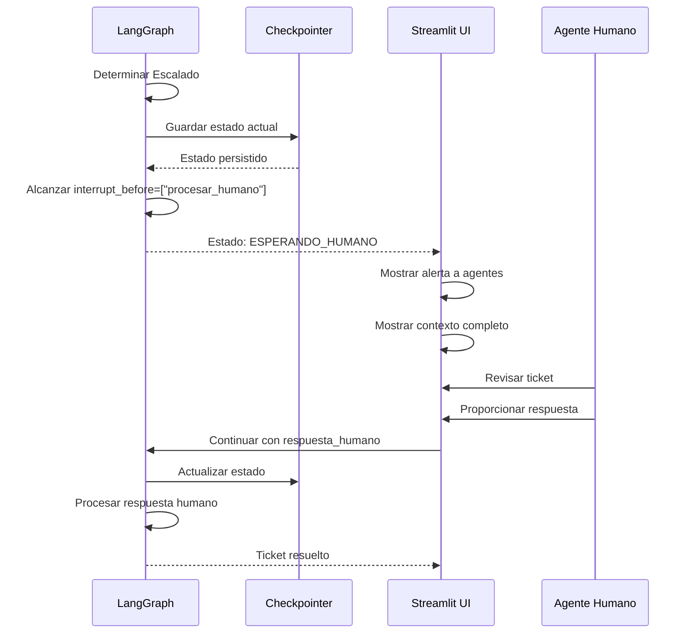

# 🎧 Sistema Helpdesk Inteligente con LangGraph y RAG

Sistema avanzado de atención al cliente que combina **LangGraph** para orquestación de flujos, **RAG (Retrieval-Augmented Generation)** para consultas a base de conocimiento, y **Human-in-the-Loop** para escalado inteligente a agentes humanos.

---

## 📑 Tabla de Contenidos

1. [Características Principales](#-características-principales)
2. [Arquitectura del Sistema](#-arquitectura-del-sistema)
3. [Flujo de Trabajo Detallado](#-flujo-de-trabajo-detallado)
4. [Componentes del Sistema](#-componentes-del-sistema)
5. [Instalación y Configuración](#-instalación-y-configuración)
6. [Uso del Sistema](#-uso-del-sistema)
7. [Estructura de Archivos](#-estructura-de-archivos)
8. [Ejemplos de Uso](#-ejemplos-de-uso)
9. [Troubleshooting](#-troubleshooting)

---

## ✨ Características Principales

- 🤖 **Clasificación Inteligente**: Determina automáticamente si una consulta puede resolverse con IA o requiere escalado humano
- 📚 **Sistema RAG Avanzado**: Búsqueda semántica en base de conocimiento con ChromaDB
- 🔄 **MultiQuery Personalizado**: Genera múltiples versiones de consultas para mejorar la recuperación de información
- 👤 **Human-in-the-Loop**: Escalado inteligente a agentes humanos con interrupciones controladas
- 💾 **Persistencia con Checkpoints**: Mantiene estado de conversaciones usando SQLite
- 🎨 **Interfaz Streamlit**: UI moderna y responsiva para usuarios y agentes
- 📊 **Métricas de Confianza**: Sistema de scoring para evaluar calidad de respuestas

---

## 🏗️ Arquitectura del Sistema

### Diagrama General de Arquitectura



### Diagrama de Flujo de Estados



---

## 🔄 Flujo de Trabajo Detallado

### 1️⃣ Fase: Procesar RAG



**Salida de esta fase:**
- `respuesta_rag`: Respuesta generada basada en documentos
- `confianza`: Score 0.0-1.0 basado en relevancia
- `fuentes`: Lista de documentos consultados
- `contexto_rag`: Contexto completo para siguiente fase

### 2️⃣ Fase: Clasificación con Contexto



**Criterios de Clasificación:**

| Criterio | Automático ✅ | Escalado 🚨 |
|----------|--------------|-------------|
| **Confianza RAG** | > 0.6 | < 0.6 |
| **Tipo de Consulta** | Procedimientos estándar | Casos únicos/complejos |
| **Información Disponible** | Completa en BD | Insuficiente |
| **Requiere Acceso** | Solo información pública | Sistemas internos |
| **Decisión de Negocio** | No requerida | Sí requerida |

### 3️⃣ Fase: Human-in-the-Loop



---

## 🧩 Componentes del Sistema

### 📦 1. `rag_system.py` - Sistema RAG

**Clase Principal: `VectorRAGSystem`**

```python
VectorRAGSystem(chroma_path: str = "chroma_db")
```

**Componentes:**

#### `CustomMultiQueryRetriever`
Implementación personalizada que reemplaza el `MultiQueryRetriever` de LangChain (no disponible en versión 1.0+).

**Funcionamiento:**
1. **Generación de Consultas**: Usa GPT para crear 3-4 variaciones de la consulta original
2. **Recuperación Múltiple**: Ejecuta búsqueda semántica para cada variación
3. **Deduplicación**: Elimina documentos duplicados por contenido
4. **Ranking**: Retorna top-10 documentos más relevantes

```python
def _generate_queries(self, query: str) -> List[str]:
    """
    Input: "¿Cómo reinicio mi contraseña?"
    Output: [
        "¿Cómo reinicio mi contraseña?",
        "Recuperar contraseña olvidada",
        "Resetear password de cuenta",
        "Cambiar clave de acceso"
    ]
    """
```

#### Cálculo de Confianza

```python
def _calcular_confianza(self, consulta: str, documentos: List) -> float:
    """
    Factores considerados:
    - Coincidencias de palabras clave (peso: 60%)
    - Número de documentos relevantes (peso: 20%)
    - Longitud/calidad del contenido (peso: 20%)
    
    Returns: Score entre 0.0 y 1.0
    """
```

**Ejemplo de Scoring:**
- Consulta: "resetear contraseña"
- Documento contiene: "Para resetear tu contraseña, ve a configuración..."
- Coincidencias: 1/2 palabras → Base: 0.5
- Documentos encontrados: 3 → Bonus: +0.15
- Contenido: 500 palabras → Bonus: +0.10
- **Confianza Final: 0.75** ✅

---

### 🔀 2. `graph.py` - Orquestación LangGraph

**Clase Principal: `HelpdeskGraph`**

#### Estado del Sistema

```python
class HelpdeskState(TypedDict):
    consulta: str                      # Consulta original del usuario
    categoria: str                     # "automatico" | "escalado"
    respuesta_rag: Optional[str]       # Respuesta del sistema RAG
    confianza: float                   # Score de confianza (0.0-1.0)
    fuentes: List[str]                 # Documentos consultados
    contexto_rag: Optional[str]        # Contexto completo para clasificación
    requiere_humano: bool              # Flag de escalado
    respuesta_humano: Optional[str]    # Respuesta del agente
    respuesta_final: Optional[str]     # Respuesta final al usuario
    historial: List[str]               # Log de acciones
```

#### Nodos del Grafo

| Nodo | Función | Input | Output |
|------|---------|-------|--------|
| **procesar_rag** | Búsqueda en base de conocimiento | `consulta` | `respuesta_rag`, `confianza`, `fuentes` |
| **clasificar_con_contexto** | Decisión automático/escalado | `consulta`, `contexto_rag`, `confianza` | `categoria` |
| **preparar_escalado** | Setup para intervención humana | Estado actual | `requiere_humano=True` |
| **procesar_humano** | Procesar respuesta del agente | `respuesta_humano` | `respuesta_final` |
| **generar_respuesta_final** | Formatear respuesta final | `respuesta_rag`/`respuesta_humano` | `respuesta_final` |

#### Construcción del Grafo

```python
def crear_grafo(self):
    graph = StateGraph(HelpdeskState)
    
    # Agregar nodos
    graph.add_node("procesar_rag", self.procesar_rag)
    graph.add_node("clasificar_con_contexto", self.clasificar_con_contexto)
    graph.add_node("respuesta_final", self.generar_respuesta_final)
    graph.add_node("preparar_escalado", self.preparar_escalado)
    graph.add_node("procesar_humano", self.procesar_respuesta_humano)
    
    # Flujo principal
    graph.add_edge(START, "procesar_rag")
    graph.add_edge("procesar_rag", "clasificar_con_contexto")
    
    # Branching condicional
    graph.add_conditional_edges(
        "clasificar_con_contexto",
        lambda state: state["categoria"],
        {
            "automatico": "respuesta_final",
            "escalado": "preparar_escalado"
        }
    )
    
    # Flujo de escalado con interrupción
    graph.add_conditional_edges(
        "preparar_escalado",
        lambda state: "esperar" if state["requiere_humano"] else "procesar_humano",
        {
            "procesar_humano": "procesar_humano",
            "esperar": END  # ⚡ Checkpoint de interrupción
        }
    )
    
    return graph
```

---

### 🎨 3. `app.py` - Interfaz Streamlit

**Arquitectura de la Interfaz:**

```
┌─────────────────────────────────────────────────────────┐
│                  HELPDESK 2.0 CON RAG                   │
├─────────────────────────────────────────────────────────┤
│  📊 PANEL DE CONTROL                                    │
│  ┌────────────────┬────────────────┬──────────────────┐ │
│  │ Total Tickets  │ Automáticos    │ Escalados        │ │
│  │      🎫        │    ✅          │    ⏳            │ │
│  └────────────────┴────────────────┴──────────────────┘ │
├─────────────────────────────────────────────────────────┤
│  🆕 CREAR NUEVO TICKET                                  │
│  ┌───────────────────────────────────────────────────┐  │
│  │ [Campo de texto para consulta]                    │  │
│  │                                                   │  │
│  │ [Botón: Enviar Consulta]                         │  │
│  └───────────────────────────────────────────────────┘  │
├─────────────────────────────────────────────────────────┤
│  📋 TICKETS ACTIVOS                                     │
│  ┌───────────────────────────────────────────────────┐  │
│  │ TK-A3F2E1                              ✅ Resuelto │  │
│  │ "¿Cómo reinicio mi contraseña?"                   │  │
│  │ Confianza: 0.85 | Fuentes: manual_usuario.md     │  │
│  └───────────────────────────────────────────────────┘  │
│  ┌───────────────────────────────────────────────────┐  │
│  │ TK-B8D4C7                        ⏳ Esperando Agent│  │
│  │ "Problema con facturación"                        │  │
│  │ Confianza: 0.45 | Escalado automático            │  │
│  │ [Campo: Respuesta Agente] [Botón: Responder]     │  │
│  └───────────────────────────────────────────────────┘  │
└─────────────────────────────────────────────────────────┘
```

**Funciones Principales:**

#### `procesar_consulta(consulta: str, ticket_id: str)`
```python
def procesar_consulta(consulta: str, ticket_id: str):
    """
    1. Crear estado inicial con consulta
    2. Ejecutar grafo con thread_id único
    3. Capturar interrupción si requiere humano
    4. Retornar estado final
    """
    config = {"configurable": {"thread_id": ticket_id}}
    estado_final = st.session_state.helpdesk.invoke(estado_inicial, config)
    return estado_final
```

#### `continuar_con_respuesta_humano(ticket_id: str, respuesta: str)`
```python
def continuar_con_respuesta_humano(ticket_id: str, respuesta: str):
    """
    1. Recuperar checkpoint con thread_id
    2. Actualizar estado con respuesta_humano
    3. Continuar ejecución del grafo
    4. Retornar estado resuelto
    """
    estado = st.session_state.helpdesk.get_state(config)
    estado_actualizado = {**estado.values, "respuesta_humano": respuesta}
    estado_final = st.session_state.helpdesk.invoke(estado_actualizado, config)
    return estado_final
```

---

### ⚙️ 4. `setup_rag.py` - Configuración RAG

**Clase: `DocumentProcessor`**

```python
def setup_rag_system(self, force_rebuild: bool = False):
    """
    Pipeline de procesamiento:
    
    1. Cargar documentos (.md, .txt, .pdf)
       ↓
    2. Text Splitting (chunks de 500 chars, overlap 100)
       ↓
    3. Generar embeddings (OpenAI text-embedding-3-large)
       ↓
    4. Almacenar en ChromaDB
       ↓
    5. Retornar vectorstore
    """
```

**Configuración de Chunks:**
```python
text_splitter = RecursiveCharacterTextSplitter(
    chunk_size=500,        # Tamaño óptimo para contexto
    chunk_overlap=100,     # Mantiene continuidad
    length_function=len,
    separators=["\n\n", "\n", " ", ""]  # Prioridad de splits
)
```

---

### 📄 5. `config.py` - Configuración Global

```python
# Rutas del sistema
CHROMADB_PATH = ".../chroma_db"
DOCS_PATH = ".../docs"

# Modelos
EMBEDDINGS_MODEL = "text-embedding-3-large"  # 3072 dimensiones
LLM_MODEL = "gpt-4o-mini"                     # Clasificación y generación

# Parámetros RAG
CHUNK_SIZE = 500
CHUNK_OVERLAP = 100
TOP_K_DOCS = 4

# Umbrales
CONFIDENCE_THRESHOLD = 0.6  # Mínimo para respuesta automática
```

---

## 🚀 Instalación y Configuración

### Prerrequisitos

- Python 3.11+
- Conda (recomendado)
- Cuenta OpenAI con API key

### Paso 1: Crear Entorno

```bash
conda create -n llms python=3.11
conda activate llms
```

### Paso 2: Instalar Dependencias

```bash
pip install langchain==1.0.3
pip install langchain-community==0.4.1
pip install langchain-core==1.0.3
pip install langchain-openai==1.0.2
pip install langchain-chroma==0.2.6
pip install langgraph==1.0.2
pip install langgraph-checkpoint==3.0.1
pip install langgraph-checkpoint-sqlite==3.0.0
pip install streamlit
pip install python-dotenv
```

### Paso 3: Configurar Variables de Entorno

```bash
# Crear archivo .env
echo "OPENAI_API_KEY=tu-api-key-aqui" > .env
```

### Paso 4: Preparar Documentos

```bash
# Crear estructura de carpetas
mkdir -p docs
mkdir -p chroma_db

# Agregar documentos a docs/
# Formatos soportados: .md, .txt, .pdf
```

### Paso 5: Inicializar Sistema RAG

```bash
# Opción 1: Desde la interfaz Streamlit
streamlit run app.py
# Click en "Configurar Sistema RAG"

# Opción 2: Script manual
python setup_rag.py
```

### Paso 6: Ejecutar Aplicación

```bash
conda activate llms
streamlit run app.py
```

Acceder a: http://localhost:8502

---

## 💡 Uso del Sistema

### Escenario 1: Consulta Automática ✅

**Entrada:**
```
Usuario: "¿Cómo reinicio mi contraseña?"
```

**Proceso Interno:**
1. **RAG**: Busca en base de conocimiento
   - Consultas generadas: ["¿Cómo reinicio mi contraseña?", "Recuperar contraseña", "Resetear password"]
   - Documentos encontrados: 3 (manual_usuario.md, faq.md)
   - Confianza: 0.85

2. **Clasificación**: Análisis con contexto
   - Información completa: ✅
   - Confianza alta: ✅
   - Categoría: **AUTOMÁTICO**

3. **Respuesta Final**:
```
Para reiniciar tu contraseña:

1. Ve a la página de inicio de sesión
2. Haz clic en "¿Olvidaste tu contraseña?"
3. Ingresa tu correo electrónico
4. Revisa tu bandeja de entrada
5. Sigue el enlace de recuperación

Fuentes consultadas: manual_usuario.md, faq.md
```

**Estado del Ticket:**
- ✅ Resuelto Automáticamente
- ⏱️ Tiempo: <5 segundos
- 🤖 Agente: IA

---

### Escenario 2: Escalado a Humano 🚨

**Entrada:**
```
Usuario: "Tengo un problema con mi factura del mes pasado, 
me cobraron doble"
```

**Proceso Interno:**
1. **RAG**: Busca información
   - Documentos: 1 (guia_facturacion.md - info general)
   - Confianza: 0.35

2. **Clasificación**:
   - Información insuficiente: ❌
   - Requiere acceso a sistemas: ✅
   - Caso específico: ✅
   - Categoría: **ESCALADO**

3. **Interrupción**: Checkpointer guarda estado
   ```python
   {
       "consulta": "...",
       "contexto_rag": "...",
       "requiere_humano": True,
       "estado": "ESPERANDO_AGENTE"
   }
   ```

4. **Notificación UI**: 
   - 🔔 Alerta a agentes
   - 📋 Muestra contexto completo
   - ⏳ Ticket en espera

5. **Agente Responde:**
```
Hola, revisé tu cuenta y efectivamente hubo un error 
en la facturación. He procesado el reembolso que verás 
reflejado en 3-5 días hábiles. Disculpa las molestias.
```

6. **Continuación del Grafo:**
   - Estado actualizado con respuesta_humano
   - Procesa respuesta
   - Genera respuesta final
   - ✅ Ticket resuelto

**Estado del Ticket:**
- ✅ Resuelto por Humano
- ⏱️ Tiempo: 5 minutos
- 👤 Agente: María González

---

## 📊 Estructura de Archivos

```
helpdesk_system/
│
├── 📄 app.py                      # Interfaz Streamlit principal
├── 📄 graph.py                    # Definición del grafo LangGraph
├── 📄 rag_system.py               # Sistema RAG con CustomMultiQueryRetriever
├── 📄 setup_rag.py                # Inicialización de vectorstore
├── 📄 config.py                   # Configuración global
├── 📄 README.md                   # Esta documentación
├── 📄 .env                        # Variables de entorno (API keys)
├── 📄 helpdesk.db                 # Base de datos SQLite para checkpoints
│
├── 📁 docs/                       # Documentos de conocimiento
│   ├── manual_usuario.md
│   ├── faq.md
│   └── guia_resolucion_problemas.md
│
├── 📁 chroma_db/                  # Base de datos vectorial
│   ├── chroma.sqlite3
│   └── [colecciones de embeddings]
│
└── 📁 __pycache__/                # Archivos Python compilados
```

---

## 🔍 Ejemplos de Uso

### Ejemplo 1: Ejecutar Consulta Programáticamente

```python
from graph import crear_helpdesk, HelpdeskState

# Inicializar sistema
helpdesk = crear_helpdesk()

# Crear estado inicial
estado = HelpdeskState(
    consulta="¿Cuál es el horario de atención?",
    categoria="",
    respuesta_rag=None,
    confianza=0.0,
    fuentes=[],
    contexto_rag=None,
    requiere_humano=False,
    respuesta_humano=None,
    respuesta_final=None,
    historial=[]
)

# Ejecutar grafo
config = {"configurable": {"thread_id": "ticket-123"}}
resultado = helpdesk.invoke(estado, config)

# Ver respuesta
print(resultado["respuesta_final"])
print(f"Confianza: {resultado['confianza']}")
print(f"Requiere humano: {resultado['requiere_humano']}")
```

### Ejemplo 2: Procesar Escalado

```python
# Primera parte: ejecutar hasta interrupción
resultado = helpdesk.invoke(estado, config)

if resultado["requiere_humano"]:
    # Simular respuesta de agente
    estado_actualizado = {
        **resultado,
        "respuesta_humano": "Aquí está la solución a tu problema..."
    }
    
    # Continuar desde checkpoint
    resultado_final = helpdesk.invoke(estado_actualizado, config)
    print(resultado_final["respuesta_final"])
```

### Ejemplo 3: Consultar Estado de Checkpoint

```python
# Obtener estado actual
config = {"configurable": {"thread_id": "ticket-123"}}
checkpoint = helpdesk.get_state(config)

print(f"Valores: {checkpoint.values}")
print(f"Siguiente nodo: {checkpoint.next}")
print(f"Metadata: {checkpoint.config}")
```

---

## 🐛 Troubleshooting

### Error: `ModuleNotFoundError: No module named 'langchain.retrievers'`

**Causa:** LangChain 1.0+ reorganizó módulos y `MultiQueryRetriever` no está disponible directamente.

**Solución:** ✅ Ya implementado
- Sistema usa `CustomMultiQueryRetriever` personalizado
- Funcionalidad idéntica al original
- No requiere cambios adicionales

---

### Error: `ModuleNotFoundError: No module named 'langgraph.checkpoint.sqlite'`

**Causa:** Falta el paquete de checkpoints SQLite.

**Solución:**
```bash
conda activate llms
pip install langgraph-checkpoint-sqlite==3.0.0
```

---

### Error: `ChromaDB no encontrado`

**Causa:** No se ha inicializado la base de datos vectorial.

**Solución:**
1. Desde Streamlit: Click en "⚙️ Configurar Sistema RAG"
2. Desde terminal:
```bash
python setup_rag.py
```

---

### Error: `OpenAI API Key no válida`

**Causa:** Variable de entorno no configurada o API key incorrecta.

**Solución:**
```bash
# Verificar .env
cat .env

# Debe contener:
# OPENAI_API_KEY=sk-...

# Si no existe, crear:
echo "OPENAI_API_KEY=tu-key-aqui" > .env
```

---

### Tickets Atascados en "Esperando Humano"

**Causa:** Estado no se actualiza después de respuesta de agente.

**Solución:**
1. Verificar que `thread_id` sea consistente
2. Usar botón "✅ Responder Ticket" en UI
3. No recargar página durante procesamiento

**Debug:**
```python
# Ver estado actual
checkpoint = helpdesk.get_state(config)
print(checkpoint.values["requiere_humano"])
print(checkpoint.next)  # Debe ser ["procesar_humano"]
```

---

### Confianza Siempre Baja

**Causa:** Documentos en base de conocimiento no relevantes o mal fragmentados.

**Solución:**
1. Revisar documentos en `docs/`
2. Ajustar chunk_size en `setup_rag.py`:
```python
chunk_size=500  # Aumentar a 800 si es necesario
chunk_overlap=100  # Aumentar a 150
```
3. Reconstruir vectorstore:
```bash
python setup_rag.py --force-rebuild
```

---

## 📈 Métricas y Monitoreo

### Logs del Sistema

```python
import logging

# Activar logs detallados
logging.basicConfig(level=logging.INFO)
logging.getLogger("langchain.retrievers").setLevel(logging.DEBUG)
```

**Output esperado:**
```
INFO:langchain.retrievers:Consultas generadas: [
    "¿Cómo reinicio mi contraseña?",
    "Recuperar contraseña olvidada",
    "Resetear password"
]
INFO:langchain.retrievers:Documentos recuperados: 3
INFO:graph:Confianza calculada: 0.85
INFO:graph:Clasificación: automatico
```

---

## 🎯 Mejores Prácticas

### 1. Organización de Documentos

```markdown
docs/
├── 01_manual_usuario.md       # Procedimientos paso a paso
├── 02_faq.md                  # Preguntas frecuentes
├── 03_troubleshooting.md      # Resolución de problemas
├── 04_politicas.md            # Políticas de la empresa
└── 05_api_docs.md             # Documentación técnica
```

**Formato recomendado para documentos:**
```markdown
# Título de la Sección

## Pregunta: ¿Cómo hacer X?

**Respuesta:**
1. Paso 1
2. Paso 2
3. Paso 3

**Nota importante:** Información adicional

---
```

### 2. Optimización de Confianza

- ✅ Documentos bien estructurados
- ✅ Información clara y directa
- ✅ Vocabulario consistente
- ✅ Ejemplos concretos
- ❌ Textos ambiguos
- ❌ Información desactualizada

### 3. Gestión de Escalados

**Buenas prácticas:**
- Proporcionar contexto completo al agente
- Incluir historial de consulta
- Documentar resolución para futura referencia
- Actualizar base de conocimiento con casos nuevos

---

## 🔒 Seguridad y Privacidad

### Manejo de Datos Sensibles

```python
# NO incluir en documentos:
- Contraseñas
- Números de tarjetas de crédito
- Información personal identificable (PII)
- Tokens de API

# SÍ incluir:
- Procedimientos generales
- Pasos de troubleshooting
- Políticas públicas
```

### Sanitización de Logs

```python
# En producción, sanitizar logs
import re

def sanitize_log(text: str) -> str:
    # Remover emails
    text = re.sub(r'\b[A-Za-z0-9._%+-]+@[A-Za-z0-9.-]+\.[A-Z|a-z]{2,}\b', '[EMAIL]', text)
    # Remover números de teléfono
    text = re.sub(r'\b\d{3}[-.]?\d{3}[-.]?\d{4}\b', '[PHONE]', text)
    return text
```

---

## 🚀 Roadmap Futuro

### Próximas Características

- [ ] **Análisis de Sentimiento**: Priorización de tickets por urgencia emocional
- [ ] **Multi-idioma**: Soporte para español, inglés, portugués
- [ ] **Integración con Slack/Teams**: Notificaciones en tiempo real
- [ ] **Dashboard de Analytics**: Métricas de rendimiento y KPIs
- [ ] **A/B Testing**: Optimización continua de respuestas
- [ ] **Fine-tuning**: Modelo personalizado para dominio específico

---

## 📞 Soporte y Contribuciones

### Reportar Bugs

```markdown
**Descripción del problema:**
[Descripción clara y concisa]

**Pasos para reproducir:**
1. ...
2. ...

**Comportamiento esperado:**
[Qué debería suceder]

**Logs relevantes:**
[Copiar logs aquí]

**Entorno:**
- Python: 3.11
- LangChain: 1.0.3
- OS: Ubuntu 22.04
```

### Contribuir

1. Fork el repositorio
2. Crear branch de feature: `git checkout -b feature/nueva-caracteristica`
3. Commit cambios: `git commit -m 'Agregar nueva característica'`
4. Push a branch: `git push origin feature/nueva-caracteristica`
5. Crear Pull Request

---

## 📚 Referencias y Recursos

### Documentación Oficial

- [LangChain](https://python.langchain.com/)
- [LangGraph](https://langchain-ai.github.io/langgraph/)
- [ChromaDB](https://docs.trychroma.com/)
- [Streamlit](https://docs.streamlit.io/)
- [OpenAI API](https://platform.openai.com/docs/)

### Tutoriales Relacionados

- [LangGraph Human-in-the-Loop](https://langchain-ai.github.io/langgraph/how-tos/human_in_the_loop/)
- [RAG Tutorial](https://python.langchain.com/docs/tutorials/rag/)
- [Vector Stores Guide](https://python.langchain.com/docs/integrations/vectorstores/)

---

## 📄 Licencia

Este proyecto está bajo la Licencia MIT. Ver archivo `LICENSE` para más detalles.

---

## 👥 Autores

**Jose Balbuena**
- GitHub: [@JoseBalbuena181096](https://github.com/JoseBalbuena181096)
- Proyecto: Ingeniería de LLM - LangChain, LangGraph y Agentes AI con Python

---

## 🙏 Agradecimientos

- Equipo de LangChain por el framework increíble
- Comunidad de desarrolladores de IA
- Colaboradores y testers

---

**Última actualización:** Noviembre 2025  
**Versión:** 2.0  
**Estado:** ✅ Producción
