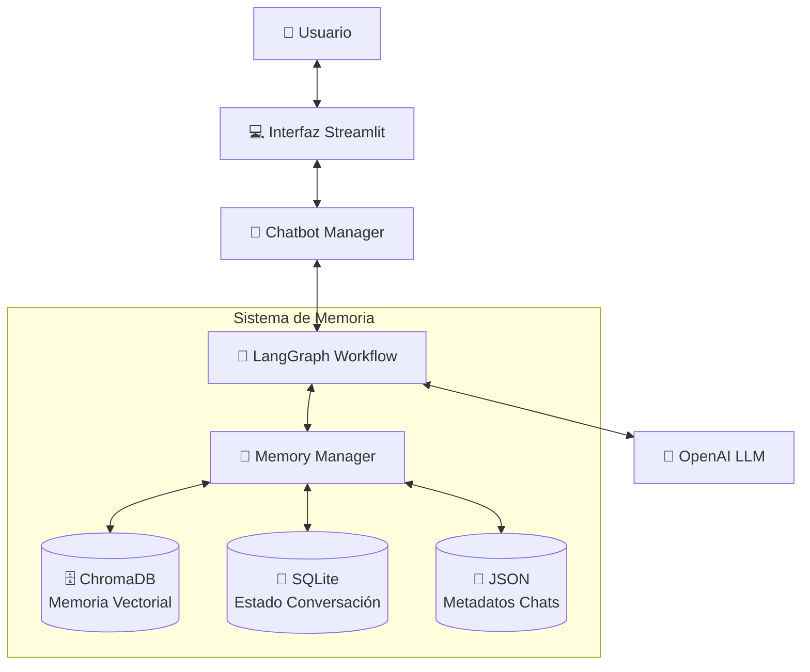
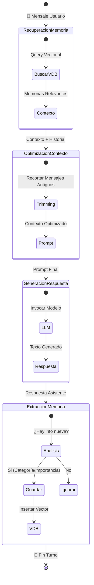

# 🤖 Chat Multi-Usuario con Memoria Avanzada

Este proyecto implementa un sistema de chat inteligente capaz de manejar múltiples usuarios, mantener el contexto de las conversaciones y gestionar una memoria a largo plazo utilizando bases de datos vectoriales. Está construido con **Python**, **Streamlit**, **LangChain** y **LangGraph**.

## 📋 Descripción General

El sistema permite a los usuarios tener conversaciones naturales con un asistente de IA que "recuerda" detalles importantes de charlas anteriores. A diferencia de los chatbots tradicionales que pierden el contexto al cerrar la sesión o superar el límite de tokens, este sistema utiliza una arquitectura híbrida de memoria:

1.  **Memoria a Corto Plazo (LangGraph)**: Mantiene el hilo de la conversación actual.
2.  **Memoria a Largo Plazo (ChromaDB)**: Almacena hechos importantes, preferencias y datos personales de forma permanente.

### Características Principales

*   **👥 Multi-Usuario**: Soporte para múltiples perfiles de usuario independientes.
*   **💾 Persistencia**: Historial de chats guardado y recuperable.
*   **🧠 Memoria Vectorial**: Extracción y recuperación automática de información relevante.
*   **⚡ Optimización de Contexto**: Gestión inteligente de tokens para conversaciones largas.
*   **🎨 Interfaz Moderna**: UI intuitiva construida con Streamlit.

## 🛠️ Tecnologías Utilizadas

*   **[Streamlit](https://streamlit.io/)**: Framework para la interfaz de usuario.
*   **[LangChain](https://www.langchain.com/)**: Orquestación de LLMs y herramientas.
*   **[LangGraph](https://langchain-ai.github.io/langgraph/)**: Gestión del flujo de conversación y estado.
*   **[ChromaDB](https://www.trychroma.com/)**: Base de datos vectorial para la memoria semántica.
*   **[OpenAI](https://openai.com/)**: Modelos de lenguaje (GPT-4o/GPT-5-nano).
*   **SQLite**: Almacenamiento de checkpoints de estado.

## 🏗️ Arquitectura del Sistema

### Flujo de Datos General



### Flujo de Procesamiento del Chat (LangGraph)

El núcleo del chatbot utiliza un grafo de estados para procesar cada mensaje:



## 🚀 Instalación y Configuración

### Prerrequisitos

*   Python 3.9+
*   Una API Key de OpenAI

### Pasos

1.  **Clonar el repositorio**
    ```bash
    git clone <url-del-repositorio>
    cd multiuser_chat_system
    ```

2.  **Instalar dependencias**
    Crea un archivo `requirements.txt` con el siguiente contenido o instálalos directamente:
    ```text
    streamlit
    langchain
    langgraph
    langchain-openai
    langchain-chroma
    chromadb
    python-dotenv
    pydantic
    ```
    
    Instalación:
    ```bash
    pip install -r requirements.txt
    ```

3.  **Configurar variables de entorno**
    Crea un archivo `.env` en la raíz del proyecto:
    ```env
    OPENAI_API_KEY=sk-tu-api-key-aqui
    ```

4.  **Ejecutar la aplicación**
    ```bash
    streamlit run app.py
    ```

## 📂 Estructura del Proyecto

*   `app.py`: Punto de entrada de la aplicación Streamlit. Maneja la UI y la gestión de sesiones.
*   `chatbot.py`: Define la lógica del chatbot usando `LangGraph`. Contiene el grafo de estados y la configuración del LLM.
*   `memory_manager.py`: Gestiona todas las operaciones de memoria (vectorial y persistencia de archivos). Incluye la lógica de extracción automática de información.
*   `config.py`: Archivo de configuración central (rutas, modelos, constantes).
*   `utils.py`: Funciones auxiliares para formateo y validación.
*   `users/`: Directorio donde se almacenan los datos persistentes de cada usuario (DBs, índices vectoriales).

## 💡 Cómo Funciona la Memoria

El sistema utiliza un enfoque proactivo para la memoria:

1.  **Extracción**: Cada vez que el usuario envía un mensaje, un modelo secundario analiza si contiene información digna de recordar (ej. "Me llamo Juan", "Soy ingeniero", "No me gusta el picante").
2.  **Categorización**: La información se clasifica en categorías (Personal, Profesional, Preferencias, Hechos Importantes) y se le asigna un nivel de importancia.
3.  **Almacenamiento**: Se convierte en un vector (embedding) y se guarda en ChromaDB.
4.  **Recuperación**: Cuando el usuario habla de nuevo, el sistema busca semánticamente en la base de datos vectorial para encontrar recuerdos relevantes y los inyecta en el contexto del LLM.

---
Desarrollado para el curso de Ingeniería de LLM y Agentes AI.
